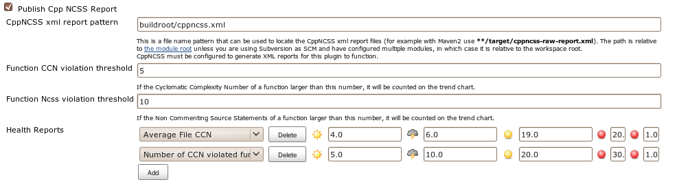

This plugin allows you to use [CppNCSS](http://cppncss.sourceforge.net/)
build reporting tool.

## The report result:

## Configuring the CppNCSS Plugin

You can configure use cppncss plugin to report in your project's
configuration page:

## Change Log

##### Version 1.2 (Feb 03, 2018)

-    [JENKINS-49237](https://issues.jenkins-ci.org/browse/JENKINS-49237) -
    Update the plugin to make it compatible with Jenkins 2.102+
    -   More info: [Plugins affected by fix for
        JEP-200](https://wiki.jenkins.io/display/JENKINS/Plugins+affected+by+fix+for+JEP-200)
-   [ JENKINS-21511](https://issues.jenkins-ci.org/browse/JENKINS-21511) -
    Graph was missing when thresholds were not defined due to
    NullPointerException
-    Mpdernize
    the plugin and update minimum Jenkins core requirement to 1.651.3
-   [Fix](https://jenkins.io/security/advisory/2018-02-26/#SECURITY-712)
    [security
    issue](https://jenkins.io/security/advisory/2018-02-26/#SECURITY-712)

##### Version 1.1 (Feb 18, 2011)

-   Fix number parse error for ncss/ccn, etc.
-   Avoid build failure when previous build does not have cppncss
    report.

##### Version 1.0 (Jun 3, 2010)
