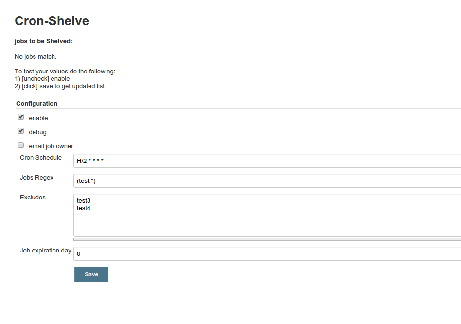

Performs job shelving actions based on cron schedule and
regex. [cron-shelve](https://github.com/jenkinsci/cron-shelve-plugin)

The cron-shelve plugin allows you to harvest hundreds of stale jobs in
consistent automated manner.  
This plugin exposes a new option in "Manage Jenkins" section called
"Cron-Shelve". This plugin is a great option in cases where the [Job DSL
Plugin](http://localhost:8085/display/JENKINS/Job+DSL+Plugin) is used  
and a consistent naming convention is maintained to deploy hundreds of
jobs.

-   \_*enable*\_: The ability to toggle execution of the plugin.
-   \_*debug*\_: Output plugin state to logs.
-   \_*email owner*\_: In order for this to be functional a given job
    must have "Set jenkins user build variables" set.
-   \_*Cron Schedule*\_: The given time period the shelving will begin.
-   \_*Jobs Regex*\_: This provides a regex method to harvest a given
    set of jobs.
-   \_*Job Expiration day*\_: Check the last build date of all jobs
    matching the regex value and if its equal or greater to job
    Expiration day shelve the job. 
    
