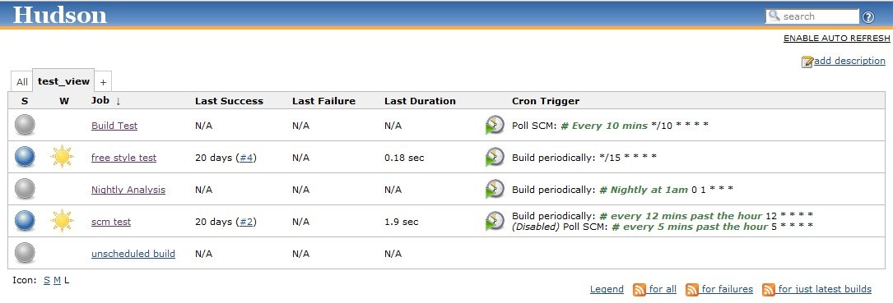

# Cron Column

View column showing the cron trigger expressions that can be configured
on a job  
(Subversion, Scheduled Builds, etc.)This is a ListViewColumn plugin that
adds a column to a jobs overview page.  
The column displays the cron-like expression of each Trigger that can be
configured on a job (Subversion, Scheduled Builds etc).

Plugin Source:
<https://hudson.dev.java.net/svn/hudson/trunk/hudson/plugins/cron_column>

# How to Use

Once you have installed this plugin, you still have to update a view to
add this column.  The pages [Changing the Columns of a
View](http://localhost:8085/display/JENKINS/Changing+the+Columns+of+a+View)
and [Editing or Replacing the All
View](http://localhost:8085/display/JENKINS/Editing+or+Replacing+the+All+View)
will show you how.

# Changelog

### Version 1.4 (Jun 16 2014)

Same as 1.1, just released to make sure it is considered newer than
1.003 (a nonstandard version string).

### Version 1.1 (Jun 12 2014)

-   Do not show column by default
    ([JENKINS-23159](https://issues.jenkins-ci.org/browse/JENKINS-23159))

#### Version 1.003 (6 Jul, 2010)

-   Plugin now works with other project types (previously only worked
    with Freestyle Projects)
