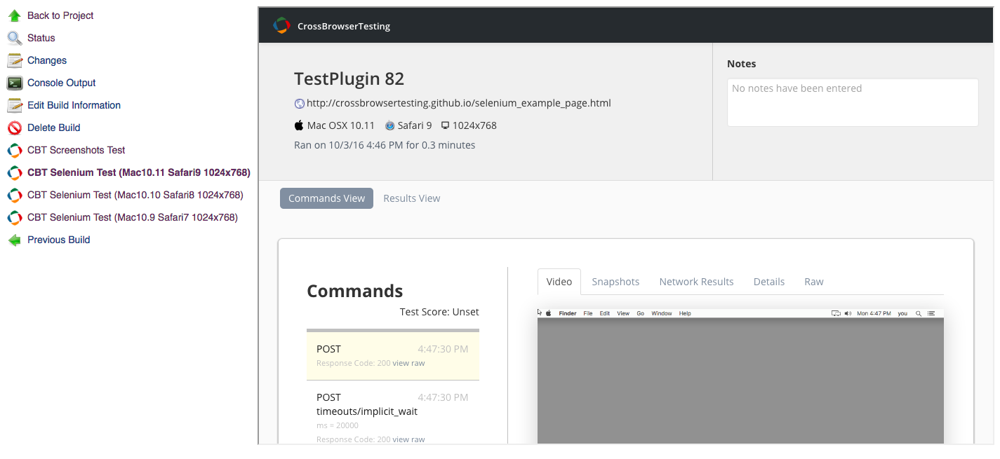

### This plugin integrates Jenkins users with Selenium Testing and Screenshot Testing on [CrossBrowserTesting.com](https://crossbrowsertesting.com/). [CrossBrowserTesting.com](http://crossbrowsertesting.com/) provides cross browser testing of websites, webpages, and web applications on Windows, Macs, and real iPhones, iPads, and Android Phones and Tablets.

 

###  Features

1.  Running Selenium Scripts on CrossBrowserTesting.com
2.  Running Automated Screenshot Testing on CrossBrowserTesting.com
3.  Automated Starting and Stopping of the CrossBrowserTesting.com
    NodeJS local tunnel to test local and development webpages behind
    your firewall (embedded and locally installed)
4.  Use named local tunnels
5.  Enable Test Views with links to download Screenshots for Screenshot
    Tests, and view videos and packet captures for Selenium scripts
6.  Use different API Credentials for each build
7.  Embedded local tunnels
8.  Supports Jenkins Pipeline
9.  Use login profiles or selenium scripts for Automated Screenshot
    Testing

### Installation

##### [via the interface](https://wiki.jenkins-ci.org/display/JENKINS/Plugins#Plugins-Usingtheinterface)

1.  Go to your installation's management screen.
2.  Click **Manage Plugins**.
3.  Click the **Available** tab.
4.  Find the **CrossBrowserTesting.com Plugin** and select the checkbox.
5.  then click either **Install without restart** or **Download now and
    install after restart**.

##### [by hand](https://wiki.jenkins-ci.org/display/JENKINS/Plugins#Plugins-Byhand)(**not recommended**)

1.  Download
    [CrossBrowserTesting.hpi](http://updates.jenkins-ci.org/latest/crossbrowsertesting.hpi).
2.  Save the downloaded .hpi file into your \`$JENKINS\_HOME/plugins\`
    directory.
3.  Restart Jenkins.

### Configuration

##### Environment Variables

The CrossBrowserTesting.com Jenkins Plugin passes your build step
information to your Selenium scripts as environment variables. The exact
syntax will vary depending on your scripting language.

|                        |                                                                                                                                        |
|------------------------|----------------------------------------------------------------------------------------------------------------------------------------|
| Variable               | Description                                                                                                                            |
| CBT\_USERNAME          | the username used on CrossBrowserTesting.com for Selenium Testing                                                                      |
| CBT\_AUTHKEY           | the apikey used on CrossBrowserTesting.com for Selenium Testing                                                                        |
| CBT\_BUILD\_NAME       | the Jenkins Project's name                                                                                                             |
| CBT\_BUILD\_NUMBER     | the Jenkins Project's current build number                                                                                             |
| CBT\_OPERATING\_SYSTEM | the apiname of the selected Operating System                                                                                           |
| CBT\_BROWSER           | the apiname of the selected Browser                                                                                                    |
| CBT\_RESOLUTION        | the name of the selected Screen Resolution                                                                                             |
| CBT\_BROWSERNAME       | the browser name without the version (**only needed for Javascript Selenium Tests**)                                                   |
| CBT\_BROWSERS          | an array of JSON objects containing the "operating\_system", "browser", "resolution, and "browserName" of each configuration specified |

See the examples directory for a few language specific sample scripts.

##### Saving Your CrossBrowserTesting.com API Credentials

1.  Go to your installation's management screen.
2.  Click **Configure System**.
3.  Find the section labeled **CrossBrowserTesting.com**.
4.  Click **Add**
5.  Select **Jenkins** as the "Jenkins Credentials Provider"
6.  Select **Crossbrowsertesting.com** as the "Kind"
7.  Enter your CrossBrowserTesting.com Username and API Key information.
    You can find your api key
    [here](https://crossbrowsertesting.com/apidocs/v3/) (must be logged
    in)
8.  Test the credentials using the **Test Credentials** button
9.  Click **Add**.
10. Select the credentials on the "configuration page"
11. Optional: You can also create and select credentials for each build
    within the build configuration page.

##### Build/Configure

###### Enable Selenium and Screenshot Views

1.  In the CrossBrowserTesting.com **Build Environment**, Select "Enable
    Test Results Pages"
2.  During your build, links on your sidebar will populate and allow you
    to interact with the test.
3.  You can view and download screenshots for a Screenshots Test
4.  You can view videos, snapshots, and network packet captures for
    Selenium Tests

{width="1000"}

###### Build Environment

1.  Configure your Jenkins Project.
2.  In **Build Environment**, Check the box next to
    **CrossBrowserTesting.com**
3.  For Screenshot Tests: Pick a BrowserList and enter a URL (you must
    have you API credentials saved for the browserlist to populate).
    **You can add multiple Screenshots Tests by clicking "Add a
    Screenshots Test"**
4.  For Selenium Tests: Add the **Operating System, Browser, and Screen
    Resolution** that you want to run a Selenium Test on. **You can add
    multiple configurations by clicking "Add a Selenium Tests"**
5.  Optional: Check **Use Local Tunnel** to run tests on webpages behind
    your firewall. The [CBT NodeJS
    Tunnel](https://github.com/crossbrowsertesting/cbt-tunnel-nodejs) is
    embedded into the plugin and does not need to be install on the
    Jenkins Server. 
    1.  To use a named tunnel, enter the "Tunnel Name" in the advanced
        section.
    2.  If you prefer not to use the embedded local tunnel and want to
        use the local tunnel installed on your system, you can specify
        the path to the local tunnel binary in the advanced section.
6.  For CBT Credentials: Select the credentials to run the tests with.

###### Execute a Selenium Test

1.  Execute a Selenium Test just as normally would with Jenkins.
2.  For example, if you were running a script written in python on a
    Unix machine, within the **Build** section, select **Add Build
    Step** and **Execute Shell** (if you have the Python Plugin
    installed you can use it instead).
3.  Enter the command to run your script ie. "python
    your\_selenium\_script.py"
4.  Click **Save**
5.  Click **Build Now** to build the project. Output from the tests will
    be displayed in **Console Output** for the build.

##### Pipeline Configuration

As of version 2.3, the plugin supports Jenkins Pipeline. Here's an
example of a pipeline script:

**pipeline example**

``` syntaxhighlighter-pre
cbt(credentialsId: 'your_credential_id', useLocalTunnel: true, useTestResults: true) {
    cbtScreenshotsTest browserList: 'Your BrowserList', url: 'http://yourawesomewebsite.com'
    cbtSeleniumTest(browser: 'Safari10', operatingSystem: 'Mac10.12', resolution: '1024x768') {
        sh 'python your_selenium_script.py'
    }
}
```
