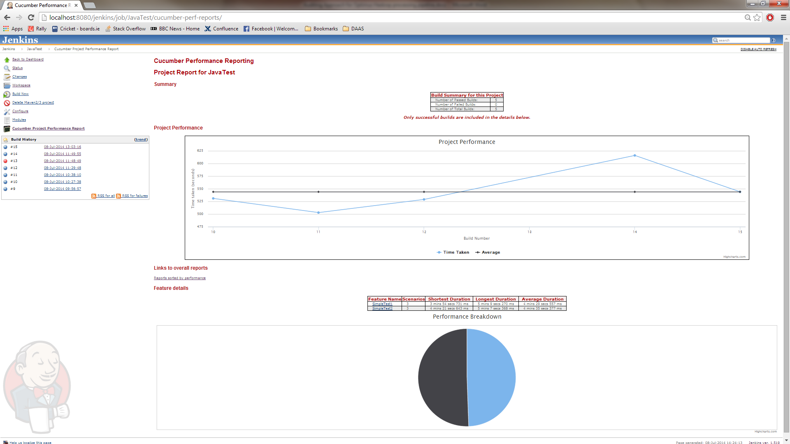
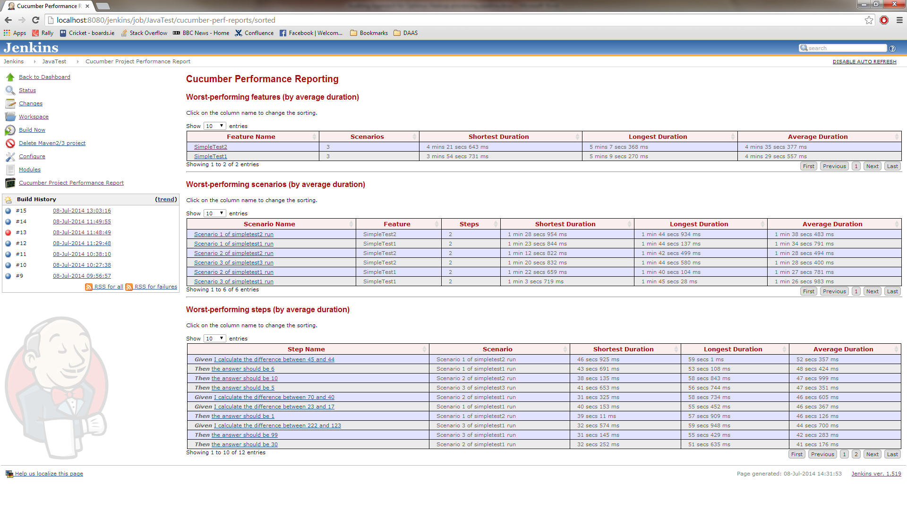

## This project is now unmaintained

Due to pressures of time, along with lack of access to a large-scale
Cucumber project to facilitate testing, I'm no longer in a position to
maintain this project. Thank you to everyone who provided feedback and
assistance.

Should anyone wish to take over as maintainer, please contact me
on <jegallagher@gmail.com> - all welcome!

This plugin reads creates performance reports for jobs running suites of
tests using Cucumber-JVM.

  
A plugin for the Jenkins continuous integration tool which allows for
reporting over time of the performance of tests executed using the
Cucumber-JVM framework.

| Version | Release Date    |
|---------|-----------------|
| 2.0.6   | 14th July 2014  |
| 1.3.1   | 5th August 2013 |
| 1.2     | 31st July 2013  |

This plugin reports on the performance over time of testing jobs run by
Jenkins containing tests using the Cucumber-JVM framework. It works by
parsing the relevant output files from Cucumber-JVM, aggregating the
information and presenting it in a coherent and easy-to-understand
format.

The main report is a graphical representation of the time taken by
successful builds of that project, and from there it's possible to drill
down into the features of that project, and onwards to scenarios and
steps.

Any suggestions for future features will be most welcome - please use
the issue reporting tool in GitHub to send me these. Bug reports are
also welcome!

This project owes a lot to the excellent Cucumber-JVM reporting plugins
developed by Kingsley Hendrickse and Masterthought, and available at
<https://github.com/masterthought> - Many thanks to them for their hard
work!

### **How to use this plugin**

1.   Install it from the Jenkins plugin update screen, then re-start
    Jenkins.
2.  In the Post-Build Actions of the job that executes the Cucumber
    tests, add "Generate Cucumber performance reports" as an action.
3.  Optionally, update the following pieces of config (by clicking the
    Advanced button)

-   -   The path relative to the workspace of the json reports generated
        by cucumber-jvm e.g. target/report - leave empty to let the
        plugin find them automagically.
    -   The name of the file containing json reports generated by
        cucumber-jvm - leave empty to use the default name of
        cucumber.json
    -   The number of items to display on the Sorted Reports screen -
        setting this to too high a number will cause performance issues.

### What you see

The main report view is:

{width="1500"}

The links on the Summary and the sections of the Pie Chart provide the
ability to drill down into the Feature -\> Scenario - \> Step views, and
the same level of information is presented, where appropriate.

The other form of information presented is the worst-performing one,
indicating which features/scenarios/steps are consistently the worst
performers.

{width="1500"}

### Change History

This list starts with V2.0.6 only

[TABLE]
