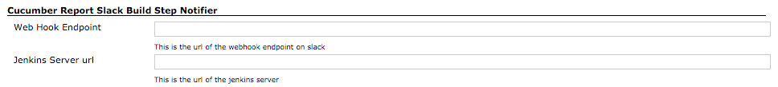
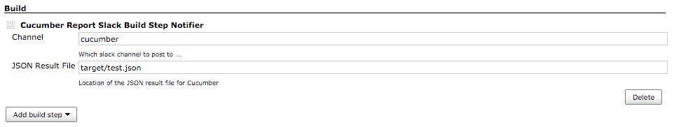

**This plugin is up for adoption.** Want to help improve this plugin?
[Click here to learn
more](http://localhost:8085/display/JENKINS/Adopt+a+Plugin "Adopt a Plugin")!

A plugin to send a summarised cucumber report to a slack channel.

## Jenkins Pipeline Usage

Use within a node block as the example below shows:

``` syntaxhighlighter-pre
node {
    stage 'Cucumber Reports'
 
    // process cucumber reports
    step([$class: 'CucumberReportPublisher', jsonReportDirectory: 'target/', fileIncludePattern: '*.json'])

    // send report to slack
    cucumberSendSlack: channel: 'test-results-channel', json: 'target/test-results.json' 
}
```

## Installation Instructions

### Global Configuration



### Job Configuration



## Change Log

##### Version 0.8.2 (4th July 2016)

-   Added ability to add custom text a message

##### Version 0.8.1 (4th July 2016)

-   Fixed issue with link generation in slack message

##### Version 0.8 (3th July 2016)

-   Added Jenkins Pipeline Support

##### Version 0.7 (17th Dec 2015)

-   Added Build Step & Post Build Notifiers
-   Added Global Config Validation
-   Implemented common service for sending notifications

##### Version 0.6.1 (17th Dec 2015)

-   Fixed invalid check for configuration

##### Version 0.6 (16th Dec 2015)

-   Correctly reading json report file from the workspace directory

##### Version 0.4 (15th Dec 2015)

-   Initial Release
