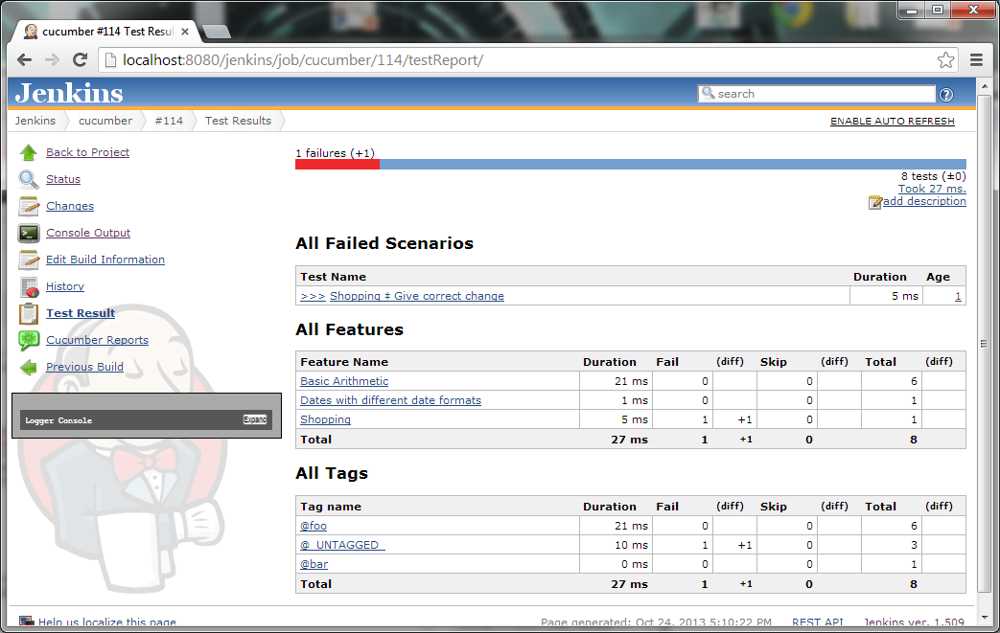
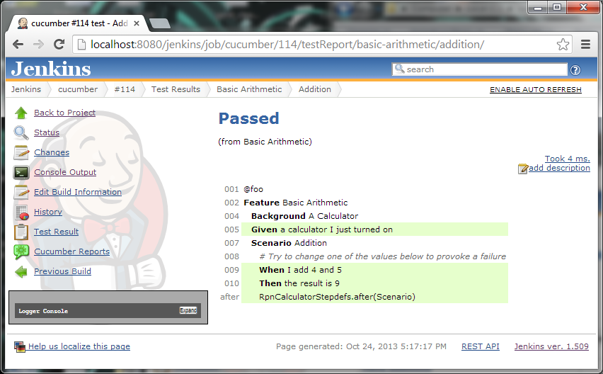
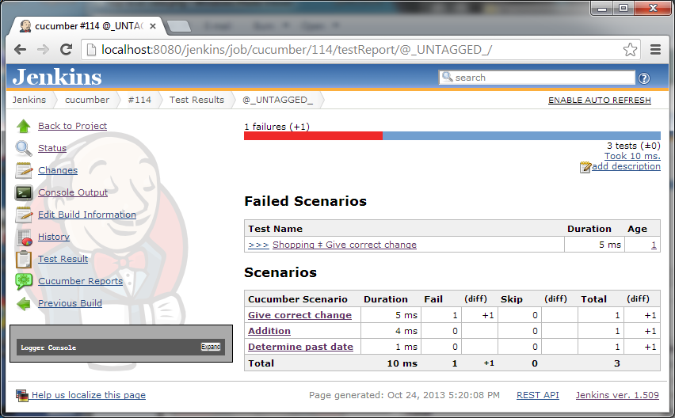
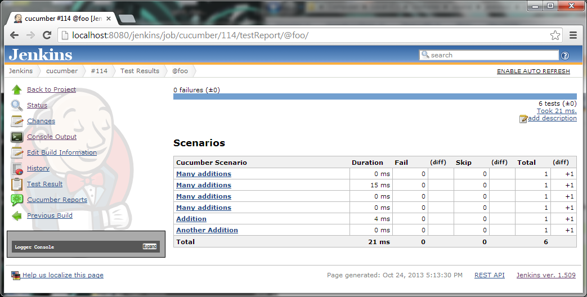

This plugin allows you to show the results of [Cucumber
tests](http://cukes.info/) within Jenkins.

# Project Configuration

To enable the plugin add the "Publish Cucumber test result report" post
build action for classic Jobs.

To record the results in Pipeline use the following syntax:

``` syntaxhighlighter-pre
cucumber 'glob'
```

where `glob` is a glob syntax - e.g. `feature.json` or `results/*.json`
or `**/target/*.json`

At the end of the build the cucumber json files will be parsed and
displayed as standard test results.

# Example Screenshots






# FAQ

## Why did you write a new cucumber reporter?

There where limitations in the way that the existing support for
Cucumber was handled that was suboptimal.

There is nothing wrong with the [cucumber jvm reports
plugin](https://github.com/masterthought/jenkins-cucumber-jvm-reports-plugin-java)
and they can be used in tandem - however that plugin doesn't offer the
normal jenkins testresult interfaces. Namely there is no trend reports
or test history. There is also no API that you can integrate with.

Likewise you could output junit xml style reports from cucumber - but
this also has limitations. Namely the output is less than stellar, you
have no view of tags or the nice goodness that the previous mentioned
plugin provides.

This plugin solves both of these issues so you only need one place to
look. We also have some grand plans to integrate this with the
[quarantine](https://github.com/samsta/quarantine) and [test
stability](http://localhost:8085/display/JENKINS/Test+stability+plugin)
plugins.

## Can I still use the other cucumber plugin.

Yes both can work side by side - but why?

# Help and Support

For Help and support please use the [Jenkins
Users](https://groups.google.com/group/jenkinsci-users) mailing list.  
To report a bug please [check the bug
tracker](http://issues.jenkins-ci.org/secure/IssueNavigator.jspa?mode=hide&reset=true&jqlQuery=project+%3D+JENKINS+AND+status+in+(Open,+%22In+Progress%22,+Reopened)+AND+component+%3D+cucumber-testresulthttp://issues.jenkins-ci.org/secure/IssueNavigator.jspa?mode=hide&reset=true&jqlQuery=project+%3D+JENKINS+AND+status+in+(Open,+%22In+Progress%22,+Reopened)+AND+component+%3D+cucumber-testresulthttp://issues.jenkins-ci.org/secure/IssueNavigator.jspa?mode=hide&reset=true&jqlQuery=project+%3D+JENKINS+AND+status+in+(Open,+%22In+Progress%22,+Reopened)+AND+component+%3D+cucumber-testresult-plugin)
to see if the issue has been reported before [creating a new
issue](http://issues.jenkins-ci.org/secure/IssueNavigator.jspa?mode=show&createNew=true).

# Version History

## 0.11 (not yet released)

build
from [source](http://localhost:8085/display/JENKINS/Source+code) or
download
from [here](https://jenkins.ci.cloudbees.com/job/plugins/job/cucumber-testresult-plugin/lastStableBuild/org.jenkins-ci.plugins$cucumber-testresult-plugin/) if
interested

## 0.10.1 (31 Jan 2018)

-   Additional
    Fix [JENKINS-49101](https://issues.jenkins-ci.org/browse/JENKINS-49101) -
    Cucumber plugin not compatible with JEP-200 in Jenkins 2.102

## 0.10 (25 Jan 2018)

-   Fix
    [JENKINS-38286](https://issues.jenkins-ci.org/browse/JENKINS-38286) -
    `NullPointerException` in pipeline snippet generator.
-   Prevent the action link appearing twice in builds.
-   add symbol support so you can now just use `cucumber '*/.json'` in
    your pipeline
-   Fix [JENKINS-49101](https://issues.jenkins-ci.org/browse/JENKINS-49101) -
    Cucumber plugin not compatible with JEP-200 in Jenkins 2.102

## 0.9.7 (15 Sept 2016)

-   Implement
    [JENKINS-26340](https://issues.jenkins-ci.org/browse/JENKINS-26340) -
    Pipeline support. Thanks to [Haoyu
    Wang](https://github.com/helloeve) for pushing this over the
    finishing line.

## 0.8.2 (27 May 2015)

-   Fix
    [JENKINS-28588](https://issues.jenkins-ci.org/browse/JENKINS-28588)
    Plugin failed in a master/slave environment.

## 0.8.1 (21 May 2015)

-   No changes - 0.8 release failed.

## 0.8 (21 May 2015)

-   Add support for [embedded
    items](http://cukes.info/reports.html#embedding-screenshots) in the
    report (e.g. images)

## 0.8-beta2 (30 Oct 2014)

-   Fix incorrect logging statements

## 0.8-beta1 (30 Oct 2014)

**Note:** this plugin now requires Jenkins 1.580 or higher

-   Workaround
    [JENKINS-21835](https://issues.jenkins-ci.org/browse/JENKINS-21835)
    plugin fails on malformed json produced by some buggy cucumber
    implementation (enable "Ignore Bad Steps" option). ([pull
    \#2](https://github.com/jenkinsci/cucumber-testresult-plugin/pull/2)
    thanks to [Kanstantsin Shautsou](https://github.com/KostyaSha))
-   Fix
    [JENKINS-25280](https://issues.jenkins-ci.org/browse/JENKINS-25280)
    test failures where not expanded correctly.

## 0.7.0 (23 Oct 2014)

-   Fix
    [JENKINS-25021](https://issues.jenkins-ci.org/browse/JENKINS-25021)
    background failure was not always causing tests to be marked as
    failed.
-   Workaround
    [JENKINS-25280](https://issues.jenkins-ci.org/browse/JENKINS-25280)
    test failures where not expanded correctly.
-   individual test results are now exported from the build api.

## 0.6.0 (6 Oct 2014)

-   Fix
    [JENKINS-24061](https://issues.jenkins-ci.org/browse/JENKINS-24061)
    pending steps are not handled correctly.
-   Fix
    [JENKINS-24435](https://issues.jenkins-ci.org/browse/JENKINS-24435)
    Test results are not joined properly when used with standard junit
    test result publisher ([pull
    \#1](https://github.com/jenkinsci/cucumber-testresult-plugin/pull/1)
    thanks to [Anatoly Bubenkov](https://github.com/bubenkoff))

## 0.5.2 (22 July 2014)

-   fixed release

## 0.5.1 (22 July 2014) - botched release

-   fix release

## 0.5 (3rd July 2014) - botched release

-   Test result age would sometimes show "1" rather than the true age of
    the failure.

## 0.4 (24th December 2013)

-   If a scenario is undefined the test should be marked as failed - and
    the html overview should show the undefined step.

## 0.3 (24th December 2013)

-   upgrade to released version of gherkin so we no loner have to
    maintain a fork now that our changes are upstream.
-   If a scenario failed due to a background failure the error details
    where empty in the overview page.

## 0.2 (24th December 2013)

**Note** requires a custom Gherkin build to build from source.

-   Background results where not tallyed prior to being propagated to
    the scenario

## 0.1-beta (3rd November 2013)

Initial release.

**Note** requires a custom Gherkin build to build from source.

**The comment list below is not monitored.**
