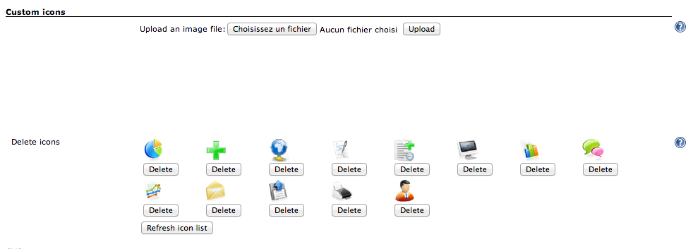

This plugin allows to configure a custom icon for each job in order to
improve the job visibility on the dashboard.

### Screenshots

{width="500"}
{width="500"}

### Upload and delete icons

Go to the *Manage Jenkins* \> *Configure System* page. Find the Custom
icons section. New icon images can be uploaded with the file upload
form.

The list of available icons is displayed on the lower part of the
section. Press the *Delete* button to delete an icon (a dialog will ask
for confirmation).

 
{width="700"}

### Changelog

#### Version 0.2 (22 Oct 2012)

-   Displays the list of uploaded icons
-   Gives the possibility to delete previously uploaded icons

#### Version 0.1 (9 Aug 2012)

-   Initial version
