Custom View Tabs plugin allows customised labels and colours for view
tabs, showing job status details.

# About

This plugin allows you to customise the view tab labels so that you can
tell at a glance when a view contains failed, unstable or disabled jobs.
You have full control over the details that are shown, can customise the
tab colour to indicate different statuses, can specify one label format
for the active tab and a different format for the inactive tab, etc.

# Quick Start

1.  Install without restart from Manage Plugins.
2.  On Configure System select "Custom Views TabBar" from the "Views
    TabBar" selection near the top of the page.
3.  Scroll to the "Custom View Tabs" config section. Click the "tab
    colour options" button and select Red for "Tab colour when failed
    jobs". Apply changes.
4.  View your Jenkins home page and views containing failed jobs should
    have red tabs.
5.  Back in the config try changing the label patterns to "$N1 - $F
    failed" and view the home page again. Tabs should now show the
    number of failures.
6.  No failures? Try "$N1 - $T jobs" to display the total number of
    jobs. 
7.  See the examples below and customise as desired.

# Usage

Perhaps you'd like the active view tab label to give you an overview of
the job statuses in the view:

Maybe you only want the label to show details of failures. You can
include any of the status counts and any text that you choose, eg:

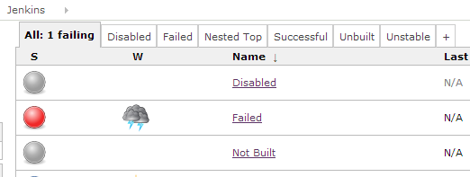

Perhaps you'd prefer a short message that shows "number of failures /
total count", eg "1/5" for one failure out of five jobs:

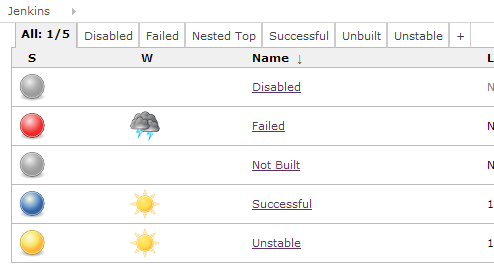

Perhaps you'd like the long version for the active tab and the short
version on all the inactive tabs:

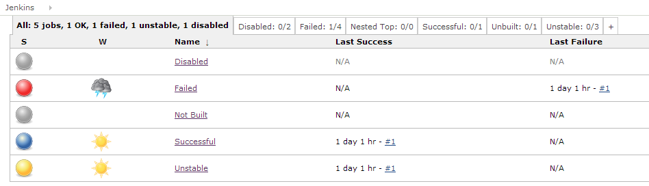

Perhaps that means the tab bar gets too long with all the views you
have, so maybe you don't want the inactive tab labels when everything on
that tab is OK:

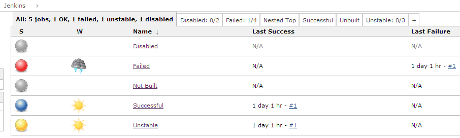

Still too long? Perhaps you'd like to use a shorter version of the name
on those inactive tabs. You can choose to use a certain number of
characters:

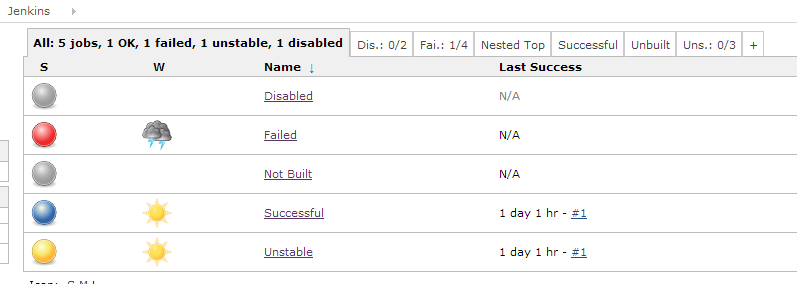

Or you can use a regular expression to do things like reducing to just
the initial letters, eg a view called "Lots Of Jobs" would become LOJ:

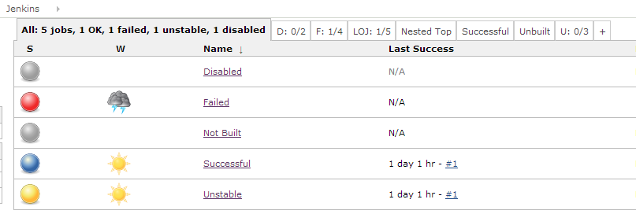

Maybe you prefer a simple indication of the number of failed jobs:

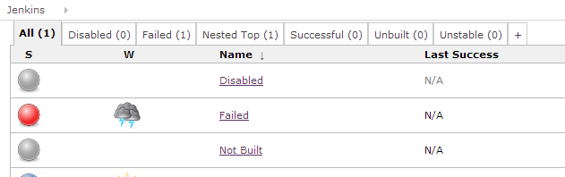

Perhaps you would just like a very subtle indication to show when a view
contains a job that is not succeeding:

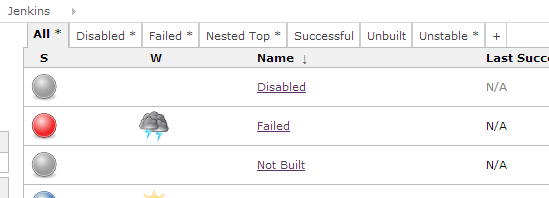

Or maybe like the next one. Remember that because broken jobs are an
incredibly rare event on your project, thanks to the efforts of your
awesome team-mates, there won't normally be quite so many tabs with
error indications. The point really is that you have a lot of control to
decide what to show and how:

Perhaps you'd just like the tabs for any view with a failing job to be
coloured red:

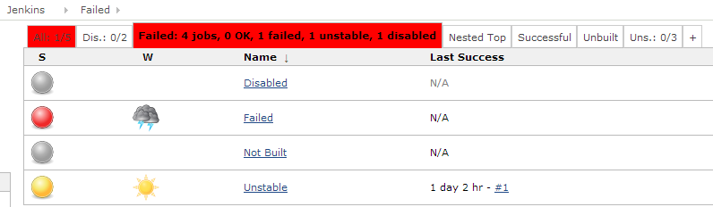

Maybe you also want tabs to be yellow when there is an unstable job.
Note that the worst status takes precedence, so in this example the
"All" tab is red because it has one failing job which is worse than the
unstable job, but the view with nothing worse than unstable is coloured
yellow:

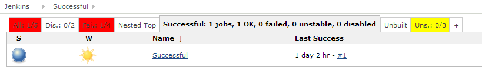

Maybe that red was too harsh so you want to specify your own colour code
for something a little more subtle:

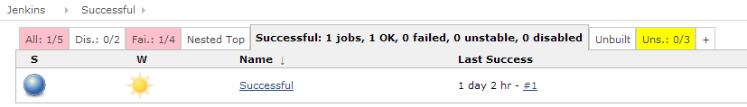

If you want, you can go mad and choose a colour for "disabled" and even
a colour to use when everything is OK, (but really you probably want to
stick to just using colours for failures, so that it gets noticed):

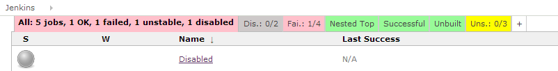

If you use nested views then the parent tab will summarise its children:

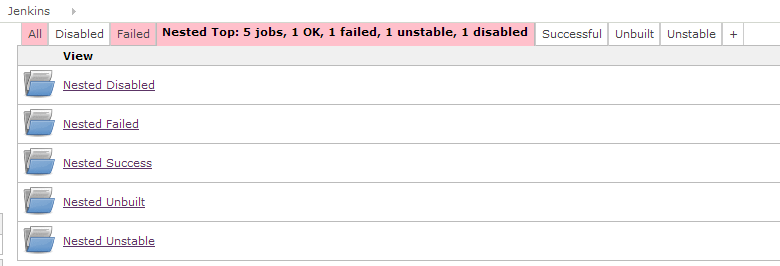

and the nested child views work just like any other:

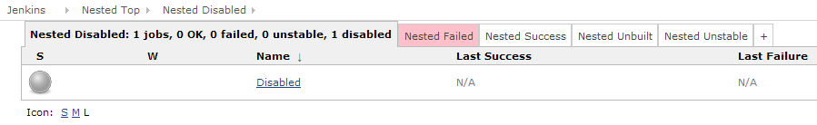

I like to have a brief message on the active tab, a subtle marker on
tabs with "problematic" jobs, and a more prominent, but still
inoffensive red indication where there are failures. This lets me get a
quick overview of what's happening, so that I can start chasing people
to fix problems or delete their outdated projects, and not let broken
builds become the norm. I want failures to be something that gets
noticed quickly, and fixed, and on a busy project with many teams
sharing one Jenkins, it takes a bit of care to ensure that old, broken
junk doesn't build up. This view is just another tool that helps me with
that:

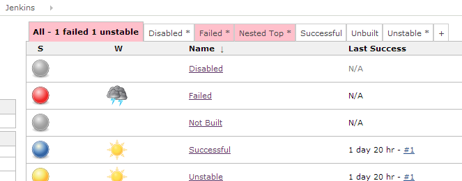

# Configuration

All configuration is in the global Jenkins config page. After
installation, you will need to choose the custom view tabs option in the
"Views Tab Bar" drop down:

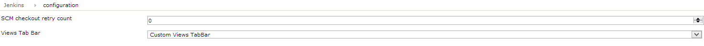{width="200"}

Label patterns are specified using any text you want and some special
placeholders for the different counts, choosing from the following:

-   $T - The Total number of jobs
-   $S - The number of jobs currently Succeeding
-   $F - The number of jobs currently Failing
-   $U - The number of jobs currently Unstable
-   $D - The number of jobs currently Disabled

and some tokens for the view name:

-   $N1 - The original view name
-   $N2 - The original view name truncated according to the short name
    length setting
-   $N3 - The original view name processed using replaceAll(regexMatch,
    regexReplacement)  - see advanced config section

eg, for the patterns you've seen in the examples above, we have:

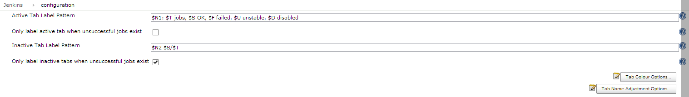{width="200"}

In the above screen you can also see the settings to control whether the
labelling should be always on or only when there is something other than
"successful" to report.

Click on the tab colour options button to select the colours to use for
different conditions, and enter your own colour codes if you don't like
the built ins:

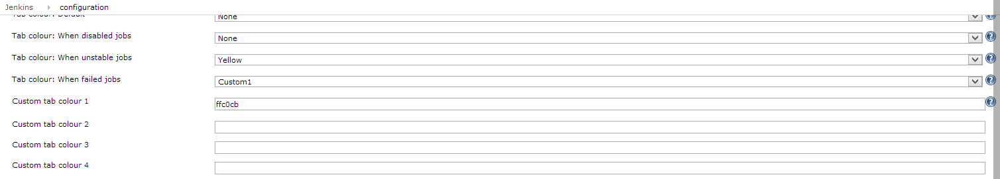{width="200"}

# Versions

#### 1.0 (18 Oct 2013)

Call it a beta version (my first attempt at a Jenkins plugin).  
Please confirm operation in a test instance of Jenkins before installing
in your production server.  
Compatible with the nested views plugin, but if you're using any other
customisations of the tab bar it probably isn't compatible.  
You can only have one views tab bar implementation active in a given
Jenkins instance.  
If you experience tabs with missing names, check that there is a naming
pattern specified for active and inactive, eg just $N1 if you want to
keep the original name.  
Please report any bugs.  
Feedback on functionality and implementation most welcome: I hope to
gain a much better understanding of how to write effective Jenkins
plugins.

#### 1.3 (19 Feb 2016)

thanks to maosmurf - updates for UI compatibility with newer Jenkins
version
