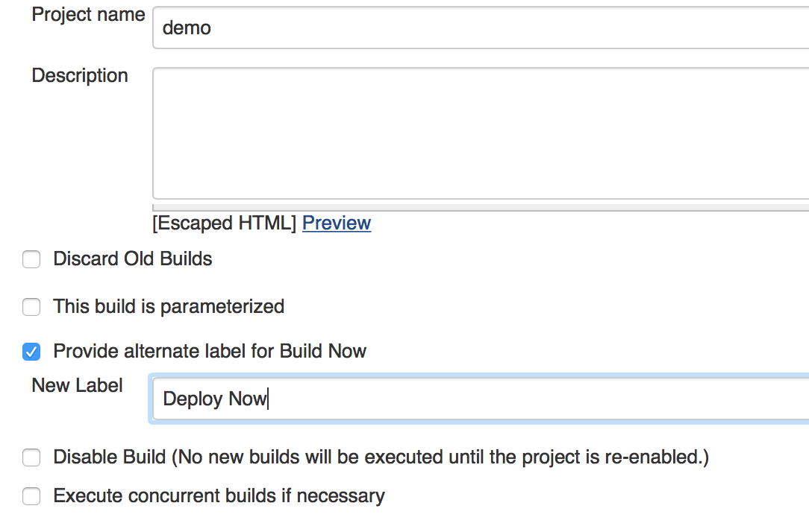
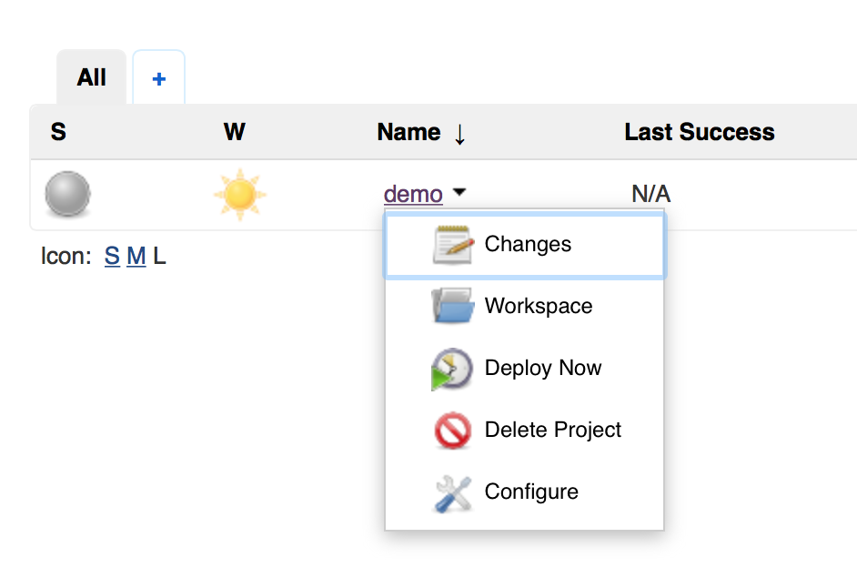
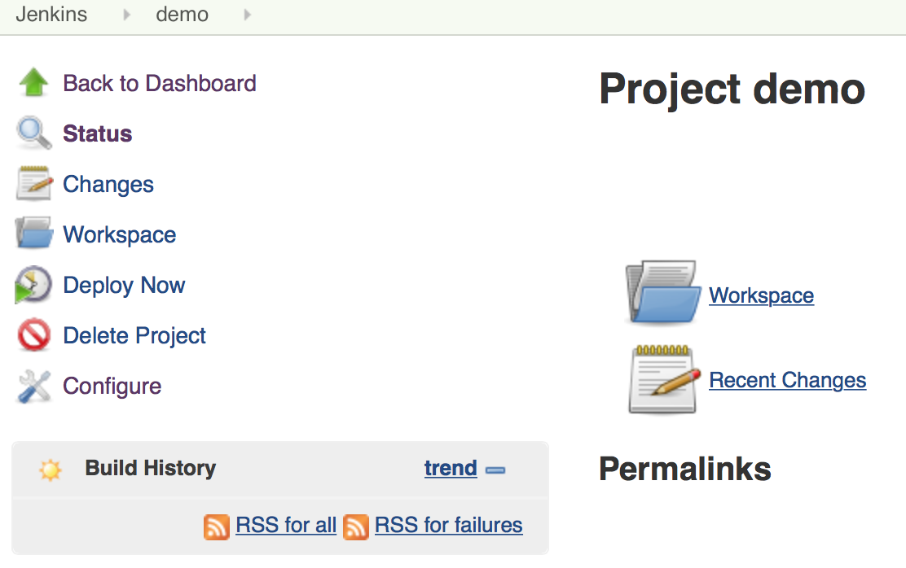

# Customize Build Now Plugin

This plugin allows users to provide an alternate label to "Build Now".
While its well understood by Jenkins experts what "Build Now" means,
sometimes its more intuitive for new Jenkins users to associate a more
appropriate label to suite the purpose of the job like "Deploy Now" or
"Execute Now" or "Promote Now" etc...  
  

## Changelog

### 1.1 (Sep 17 2015)

-   Workflow support.
