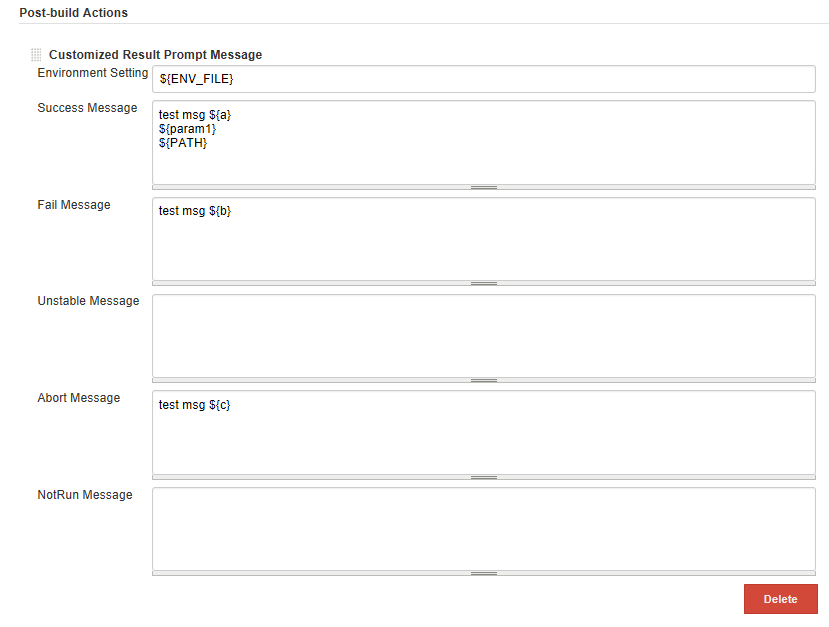
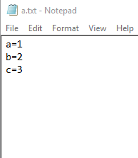
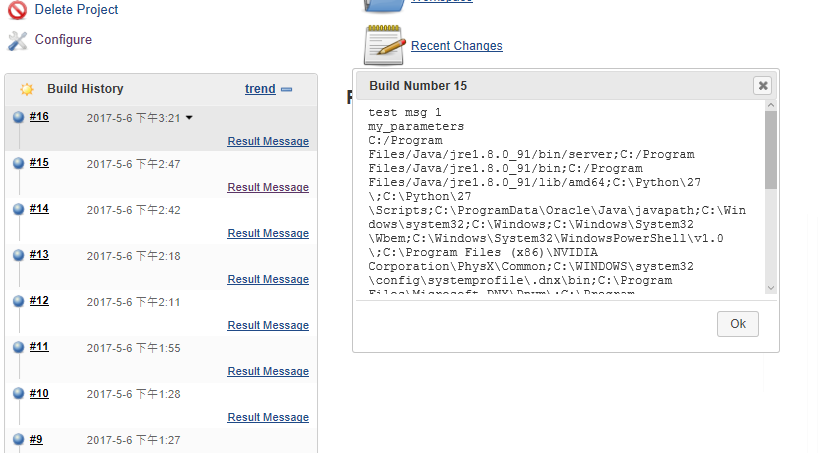
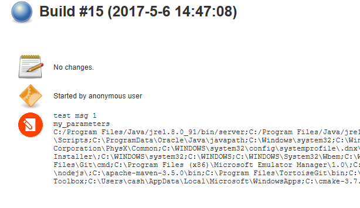

 

 

## \# Screenshots

  

### **\#\# Job configuration**

  

\*\*Support the environemnt variable files, input parameters, and
default environment variables.\*\*

  

{width="500"}

  

\*\*Environment variable customizations, both local & remote (slaves)
file path are supported.\*\*

  

  

\*\*Start to build\*\*

  

  

### **\#\# Result**

  

\- build job badge

  

{width="500"}

  

\- build job summary

  

{width="500"}

# Release Note

 

-   ## v1.1

    -   Support build description as a job property
    -   Use icon for the result message badge

-   ## v1.0

    -   Support customized post build prompt message
