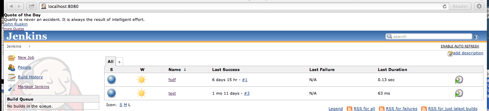
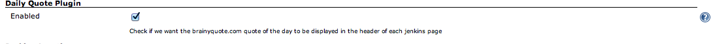

This plugin displays the www.brainyquote.com quote of the day on each
Jenkins Page when plugin is enabled 

# Features

This plugin will display the brainy quote.com "Quote of the day" in each
page header.

# Configuration

To enable, click "Enabled" in the 'Daily Quote Plugin' section located
under Manage Jenkins-\>Configure System :

# History

### Version 1.0 (Nov 30, 2013)

-   First release
