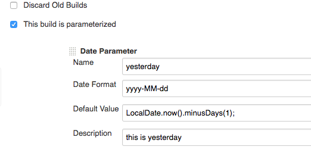
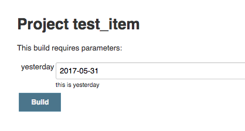
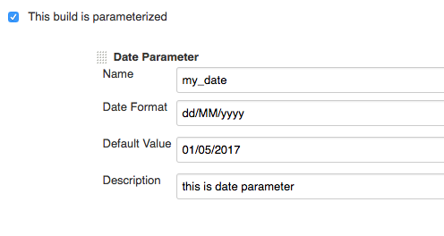
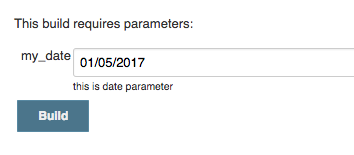

## Summary

------------------------------------------------------------------------

This plug-in provides Date parameters in two forms.

  

## Requirements

------------------------------------------------------------------------

Jenkins version 1.614 or newer is required. (jdk \>= 7.0)

  

## Configuration

------------------------------------------------------------------------

### Date Format

This is Java style date format.

-   example1) yyyyMMdd
-   example2) yyyy-MM-dd

### Default Value

You can use two types value

  

#### Java coding style

This value support LocalDate, LocalDateTime. but allows only contains
plusXXX, minusXXX methods. this value will apply '**Date Format'** when
you build.

Semicolon is not mandatory.

  

-   -   example1) LocalDate.now();

    -   example2) LocalDateTime.now()
    -   example3) LocalDate.now().plusDays(5).minusMonths(1);

#### String style

In this case. plugin will validate this value to **'Date Format'**

-   -   example1) 2018-05-01
    -   example2) 01/05/2018

## Screenshot

------------------------------------------------------------------------

  

  

### LocalDate style.

  

{width="522"
height="277"}

{width="418"
height="223"}

### **String style.**

{width="496"
height="264"}

{width="354"
height="155"}

## History

------------------------------------------------------------------------

  

##### Version 0.0.4 (Oct 23, 2018)

-   fixed bug (parameter is lost upon restart). thanks to @PierreBtz
    ([\#PR-5](https://github.com/jenkinsci/date-parameter-plugin/pull/5))

##### Version 0.0.3 (Jan 22, 2018)

-   support LocalDateTime. thanks to @etraikov
    ([\#PR-2](https://github.com/jenkinsci/date-parameter-plugin/pull/2))

##### Version 0.0.2 (Jun 29, 2017)

-   fixed bug (scheduled build problem)

##### Version 0.0.1 (June 2, 2017)

-   initial release
