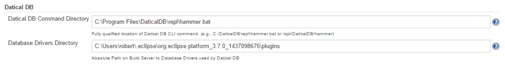
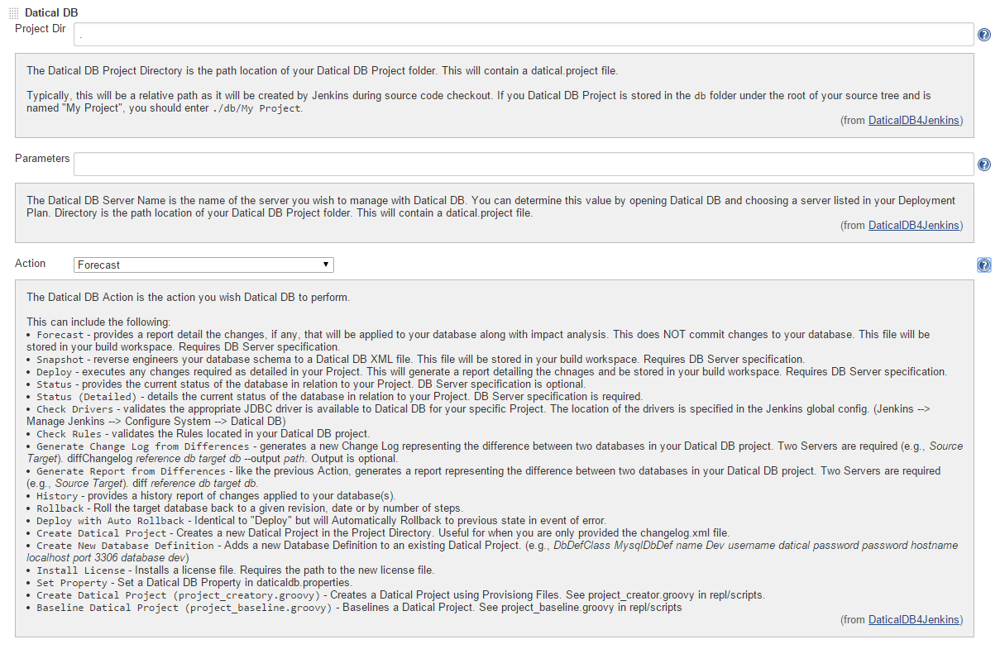
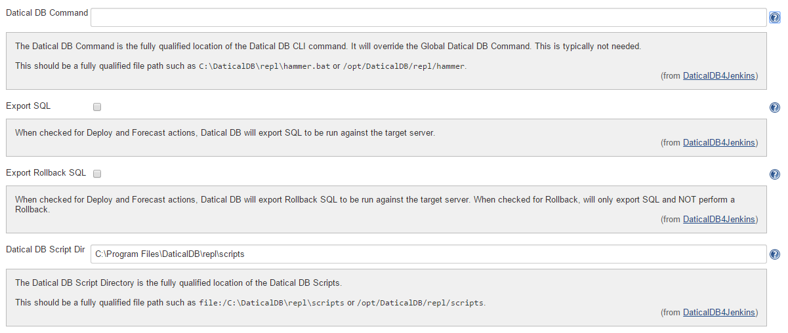

This plugin adds [Datical DB](http://www.datical.com/) support to
Jenkins and requires Datical DB to be installed.

# Screenshot

Global Configuration:

  
Project Configuration

Advanced Project Configuration

# Change Log

### Version 1.0.38 (May 18, 2015)

-   Added support for Convert SQL Groovy script.

### Version 1.0.35 (March 30, 2015)

-   Added support for Groovy scripts.

### Version 1.0.23 (October 6, 2014)

-   Added support for Check Rules.

### Version 1.0.22 (June 26, 2014)

-   Added support for Export SQL for Rollback. Previously, this was only
    available for Forecast and Deploy.

### Version 1.0.21 (June 19, 2014)

-   Added support for Export SQL and Export Rollback SQL

### Version 1.0.20 (Apr 28, 2014)

-   Added support for installing a License Key

### Version 1.0.19 (Apr 21, 2014)

-   Added support for newProject and newDBDef commands. Used for when
    you want to create a Datical DB project dynamically.

### Version 1.0.18 (Feb 17, 2014)

-   Added ability to set Project specific Datical DB Command and
    override Global setting. Useful for Master-Node installs.

### **Version 1.0.16 (Feb 14, 2014)**

-   Added support for Status Details action.

### **Version 1.0.15 (Feb 7, 2014)**

-   Added support for Rollback and Auto Rollback actions.

### Version 1.0.14 (Nov 12, 2013)

-   Replaced Radio Buttons with Select list.
-   Added support for Diff and History actions.

### Version 1.0.13 (Nov 8, 2013)

-   Fixed diffChangelog issue on Linux.

### Version 1.0.12 (Nov 2, 2013)

-   Added support for new diffChanglog functionality.

### Version 1.0.6 (Sep 24, 2013)

-   JENKINS-19667 - Fixed path issue on non-Windows platforms.

### Version 1.0.4 (Jun 17, 2013)

-   Initial Release
