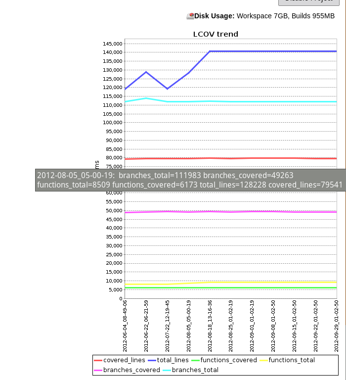

Add charts based on JDBC database data series.  

<http://piotr.tabor.waw.pl/2009/09/07/dbcharts-hudson-plugin-to-plot-a-db-charts>

## Change Log

##### Version 0.5.2 (Jun 29, 2013)

-   Added Sqlite support for string data

##### Version 0.4 (Feb 17, 2011)

-   Avoid exception at first startup.

##### Version 0.3 (Mar 15, 2010)

-   Avoid error if global config is saved with no JDBC connections.
    ([JENKINS-5916](https://issues.jenkins-ci.org/browse/JENKINS-5916))

##### Version 0.2.1 (Sep 20, 2009)
