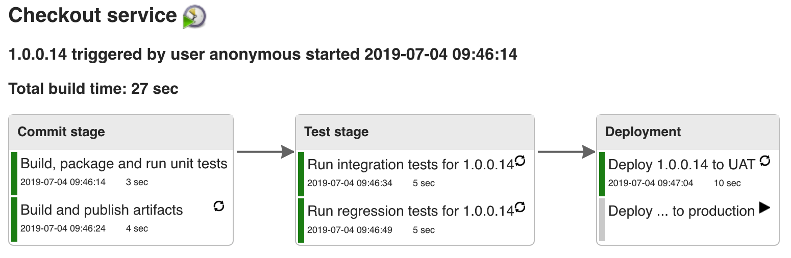
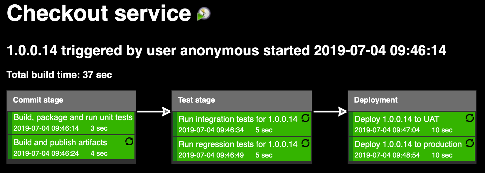
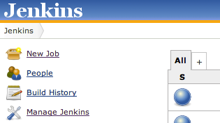
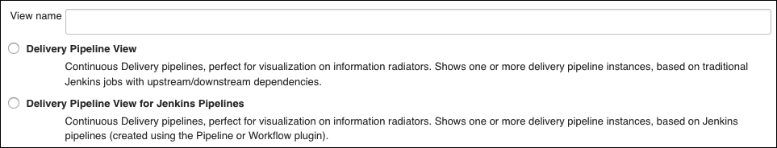
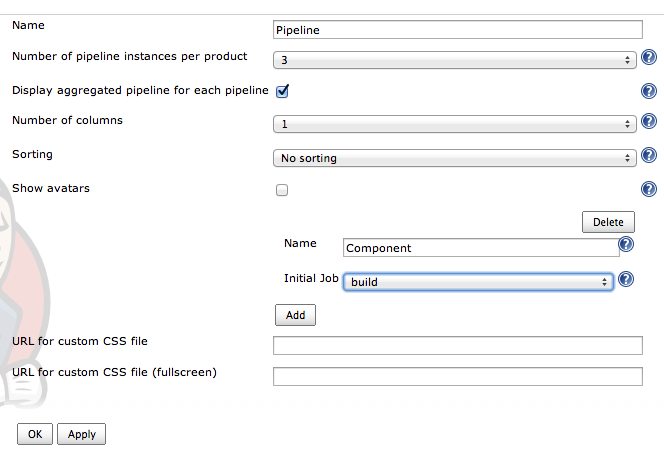

# Summary

Visualisation of Continuous Delivery pipelines. Renders pipelines based
on upstream/downstream jobs or Jenkins pipelines. Provides a full screen
view for information radiators.  
In Continuous Delivery, feedback and visualisation of the delivery
process is one of the most important aspects. When using Jenkins as a
build/CI/CD server, it is with the Delivery Pipeline plugin possible to
visualise one or more delivery pipelines in the same view, even in full
screen.

  

{height="250"}

Jenkins jobs are tagged with a stage and a task name. In the screenshot
above, the pipeline consists of three stages called Commit stage, Test
stage and Deployment. The first stage consists of two tasks called
"Build, package and run unit tests" and "Build and publish artifacts".
Each task corresponds to a traditional Jenkins job.

The plugin requires your pipelines to be built using traditional Jenkins
jobs with downstream/upstream relationships or using Jenkins pipelines.
For downstream/upstream jobs, automatic promotion steps use the
Parameterized Trigger Plugin while manual steps are provided using the
Build Pipeline plugin manual trigger (see example with manual trigger
below). Aggregated view shows the latest version for each stage.

  

{height="250"}

# Full screen view

Example screenshot when using the Delivery Pipeline plugin in full
screen view (suitable for information radiators):

{height="250"}

# Configuration

## Using traditional Jenkins jobs

-   Create jobs with downstream/upstream relationships.
-   Tag your Jenkins jobs with which stage it belongs to and the task
    name in the "Delivery Pipeline configuration" section.

## Jenkins pipelines

-   Create a Jenkins pipeline. No additional configuration is needed as
    the stage nodes are used for rendering the pipeline view. Tasks can
    be defined using the [task pipeline
    step](https://jenkins.io/doc/pipeline/steps/delivery-pipeline-plugin/#task-task).
    Multi-branch pipelines are also supported.
-   The following blog post shows how to use task's inside pipeline
    stages for a more fine-grained visualization of pipelines using the
    Delivery Pipeline
    plugin: [http://blog.diabol.se/?p=1021](http://www.google.com/url?q=http%3A%2F%2Fblog.diabol.se%2F%3Fp%3D1021&sa=D&sntz=1&usg=AFQjCNGLdtvrktwnuefm_fz18B1LiCbndw)

## View

-   Create a view by clicking the +  
    
-   Choose "Delivery Pipeline View" for traditional jobs with
    upstream/downstream dependencies, or "Delivery Pipeline View for
    Jenkins pipelines" when using Jenkins pipelines. Give the view a
    name.  
    
-   Configure the view by choosing the number of pipeline instances,
    component name and choose the first Jenkins job for each pipeline
    (applicable for traditional Jenkins jobs).  
    

## Manual Triggers

-   Make sure that the Build Pipeline plugin is installed and enabled.
-   Create or edit a job and add a Postbuild action  
    

## Known issues

JUnit plugin needs to be installed and enabled.  
If arrows are missing between the stages, please take look at
[JENKINS-28055](https://issues.jenkins-ci.org/browse/JENKINS-28055)

# Need help

Join our Google Group
https://groups.google.com/forum/\#\\!forum/delivery-pipeline-plugin\\\|https://groups.google.com/forum/\#\\!forum/delivery-pipeline-plugin
(https://groups.google.com/forum/\#\\!forum/delivery-pipeline-plugin)

# Open Tickets (bugs and feature requests)

type

key

summary

assignee

reporter

priority

status

resolution

created

updated

due

Data cannot be retrieved due to an unexpected error.

[View these issues in
Jira](https://issues.jenkins-ci.org/secure/IssueNavigator.jspa?reset=true&jqlQuery=project%20=%20JENKINS%20AND%20status%20in%20%28Open,%20%22In%20Progress%22,%20Reopened%29%20AND%20%28component%20=%20delivery-pipeline-plugin%20OR%20component%20=%20delivery-pipeline-plugin%29&tempMax=1000&src=confmacro)

# Changelog

Starting from version 0.10.1, the Delivery Pipeline Plugin is released
completely automatically and the generated release notes can be found on
GitHub:

<https://github.com/Diabol/delivery-pipeline-plugin/releases/>

### 0.10.0 (Nov 16 2016)

<https://github.com/Diabol/delivery-pipeline-plugin/releases/tag/delivery-pipeline-plugin-0.10.0>

### 0.9.12 (Jun 8 2016)

<https://github.com/Diabol/delivery-pipeline-plugin/releases/tag/delivery-pipeline-plugin-0.9.12>

### 0.9.11 (May 24 2016)

-   
      Added missing icons from contrast
    theme [JENKINS-35086](https://issues.jenkins-ci.org/browse/JENKINS-35086) [PR](https://github.com/Diabol/delivery-pipeline-plugin/pull/184)

### 0.9.10 (May 20 2016)

-   
      Subprojects should be resolved first
    [JENKINS-30043](https://issues.jenkins-ci.org/browse/JENKINS-30043) [PR](https://github.com/Diabol/delivery-pipeline-plugin/pull/168)
-   
      Fixed test result
     [JENKINS-33965 ](https://issues.jenkins-ci.org/browse/JENKINS-33965)[PR](https://github.com/Diabol/delivery-pipeline-plugin/pull/173)
-   
      CSS fix for Firefox and IE
    [JENKINS-33175](https://issues.jenkins-ci.org/browse/JENKINS-33175) [PR](https://github.com/Diabol/delivery-pipeline-plugin/pull/176)
-   
      Added Paging option to Delivery Pipeline
    [JENKINS-28918](https://issues.jenkins-ci.org/browse/JENKINS-28918) [PR](https://github.com/Diabol/delivery-pipeline-plugin/pull/174)
-   
      Added Themes for DPP and ability to select from different
    options [JENKINS-34041](https://issues.jenkins-ci.org/browse/JENKINS-34041) [PR](https://github.com/Diabol/delivery-pipeline-plugin/pull/178) [PR](https://github.com/Diabol/delivery-pipeline-plugin/pull/180)

### 0.9.9 (Mar 28 2016)

-   
    Rebuilding broken in Jenkins ver. 1.653
    [JENKINS-33594](https://issues.jenkins-ci.org/browse/JENKINS-33594)
    [PR](https://github.com/Diabol/delivery-pipeline-plugin/pull/170)
-   
    Fix stage header high with new jenkins base
    [JENKINS-31996](https://issues.jenkins-ci.org/browse/JENKINS-31996)
    [PR](https://github.com/Diabol/delivery-pipeline-plugin/pull/166)

### 0.9.8 (Dec 12 2015)

-   
    Use annotated commit message
    [JENKINS-31577](https://issues.jenkins-ci.org/browse/JENKINS-31577)
    [PR](https://github.com/Diabol/delivery-pipeline-plugin/pull/164)
-   
    Unknown cause when Git hook triggered build
    [JENKINS-30209](https://issues.jenkins-ci.org/browse/JENKINS-30209)
    [PR](https://github.com/Diabol/delivery-pipeline-plugin/pull/155)
-   
    Pipeline view should show multiple stages per row
    [JENKINS-31317](https://issues.jenkins-ci.org/browse/JENKINS-31317)
    [PR](https://github.com/Diabol/delivery-pipeline-plugin/pull/163)

### 0.9.7 (Aug 27 2015)

-   
    Delivery pipeline sometimes uses job name instead of taskname
    [JENKINS-30170](https://issues.jenkins-ci.org/browse/JENKINS-30170)
    [PR](https://github.com/Diabol/delivery-pipeline-plugin/pull/153)
    [PR](https://github.com/Diabol/delivery-pipeline-plugin/pull/154)

### 0.9.6 (Aug 26 2015)

-   
    Erratic PIPELINE\_VERSION behavior with other Parameters
    [JENKINS-28848](https://issues.jenkins-ci.org/browse/JENKINS-28848)
    [PR](https://github.com/Diabol/delivery-pipeline-plugin/pull/120)
-   
    TokenMacro for getting a version value stored in environment
    variable
    [JENKINS-23485](https://issues.jenkins-ci.org/browse/JENKINS-23485)
    [PR](https://github.com/Diabol/delivery-pipeline-plugin/pull/128)
-   
    Ability to provide description for the task
    [JENKINS-29637](https://issues.jenkins-ci.org/browse/JENKINS-29637)
    [JENKINS-20608](https://issues.jenkins-ci.org/browse/JENKINS-20608)
    [PR](https://github.com/Diabol/delivery-pipeline-plugin/pull/138)
-   
    Show commit id in changes
    [JENKINS-29580](https://issues.jenkins-ci.org/browse/JENKINS-29580)
    [PR](https://github.com/Diabol/delivery-pipeline-plugin/pull/145)
-   
    /search/suggest and /search throw Caused by:
    java.lang.NullPointerException
    [JENKINS-29521](https://issues.jenkins-ci.org/browse/JENKINS-29521)
    [PR](https://github.com/Diabol/delivery-pipeline-plugin/pull/146)
-   
    Ability to split sequence of jobs for multiple pipelines
    [JENKINS-29806](https://issues.jenkins-ci.org/browse/JENKINS-29806)
    [PR](https://github.com/Diabol/delivery-pipeline-plugin/pull/144)
-   
    Extend description with more build results
    [JENKINS-30051](https://issues.jenkins-ci.org/browse/JENKINS-30051)
    [PR](https://github.com/Diabol/delivery-pipeline-plugin/pull/148)

### Release 0.9.5 (Jul 28 2015)

-   
    Manual trigger for the downstream job is shown even if the build
    failed
    [JENKINS-28937](https://issues.jenkins-ci.org/browse/JENKINS-28937)
    [PR](https://github.com/Diabol/delivery-pipeline-plugin/pull/121)
-   
    Rebuild not respecting permissions
    [JENKINS-28845](https://issues.jenkins-ci.org/browse/JENKINS-28845)
    [PR](https://github.com/Diabol/delivery-pipeline-plugin/pull/122)
-   
    Show promotions and description on the pipeline
    [PR](https://github.com/Diabol/delivery-pipeline-plugin/pull/113)
    [PR](https://github.com/Diabol/delivery-pipeline-plugin/pull/124)
    [PR](https://github.com/Diabol/delivery-pipeline-plugin/pull/141)
-   
    Fixed deprecations and small fixes
    [PR](https://github.com/Diabol/delivery-pipeline-plugin/pull/131)
    [PR](https://github.com/Diabol/delivery-pipeline-plugin/pull/134)
-   
    Successful build should not show solid green background color
    [JENKINS-28837](https://issues.jenkins-ci.org/browse/JENKINS-28837)
    [PR](https://github.com/Diabol/delivery-pipeline-plugin/pull/129)
-   
    Better description of columns property
    [JENKINS-29324](https://issues.jenkins-ci.org/browse/JENKINS-29324)
    [PR](https://github.com/Diabol/delivery-pipeline-plugin/pull/132)
-   
    Correct verbiage in some of the help text
    [PR](https://github.com/Diabol/delivery-pipeline-plugin/pull/136)
-   
    'Enable start of new pipeline build' does not work with
    parameterized trigger
    [JENKINS-29133](https://issues.jenkins-ci.org/browse/JENKINS-29133)
    [PR](https://github.com/Diabol/delivery-pipeline-plugin/pull/137)
-   
    Better help text for TokenMacro:s
    [PR](https://github.com/Diabol/delivery-pipeline-plugin/pull/141)

### Release 0.9.4 (09 Jun 2015)

-   
    Pointer cursor for rebuild and manual task
    [PR](https://github.com/Diabol/delivery-pipeline-plugin/pull/117)
-   
    Add simple title to triggers
    [PR](https://github.com/Diabol/delivery-pipeline-plugin/pull/118)
-   
    Show total build time
    [JENKINS-22482](https://issues.jenkins-ci.org/browse/JENKINS-22482)
    [PR](https://github.com/Diabol/delivery-pipeline-plugin/pull/103)

### Release 0.9.3 (02 May 2015)

-   
    MethodNotAllowed error when start new build
    [JENKINS-28582](https://issues.jenkins-ci.org/browse/JENKINS-28582)
    [PR](https://github.com/Diabol/delivery-pipeline-plugin/pull/116)

### Release 0.9.2 (01 May 2015)

-   
    Catch case where too many capture groups defined
    [PR](https://github.com/Diabol/delivery-pipeline-plugin/pull/111)
-   
    Join Plugin & Delivery Pipeline Plugin: View logs warnings about
    existing downstream projects
    [JENKINS-28619](https://issues.jenkins-ci.org/browse/JENKINS-28619)
    [PR](https://github.com/Diabol/delivery-pipeline-plugin/pull/114)

### Release 0.9.1 (17 May 2015)

-   
    Hardcoded url for image
    [JENKINS-22921](https://issues.jenkins-ci.org/browse/JENKINS-22921)
-   
    Double slash // in url for triggering new pipelines
    [JENKINS-22921](https://issues.jenkins-ci.org/browse/JENKINS-22921)
-   
    Doesn't detect promotion "Trigger/call builds on other projects"
    [JENKINS-28347](https://issues.jenkins-ci.org/browse/JENKINS-28347)

### Release 0.9.0 (15 May 2015)

-   
    Rebuild
    [JENKINS-25298](https://issues.jenkins-ci.org/browse/JENKINS-25298)
-   
    If first job in pipeline is queued, no new pipeline instance is
    shown in view
    [JENKINS-22947](https://issues.jenkins-ci.org/browse/JENKINS-22947)
-   
    Now it is possible to show 50 pipeline instances
    [JENKINS-27667](https://issues.jenkins-ci.org/browse/JENKINS-27667)
-   
    NPE when upstream build has been deleted
    [JENKINS-27584](https://issues.jenkins-ci.org/browse/JENKINS-27584)
-   
    Build Now menu to trigger the pipeline manually
    [JENKINS-22921](https://issues.jenkins-ci.org/browse/JENKINS-22921)

### Release 0.8.11 (23 March 2015)

-   
    Support jobs organized under folders (RegExp)
    [JENKINS-27270](https://issues.jenkins-ci.org/browse/JENKINS-27270)
-   
    NPE when using jobs with the same name in different folders
    [JENKINS-27539](https://issues.jenkins-ci.org/browse/JENKINS-27539)

### Release 0.8.10 (17 March 2015)

-   
    Speed improvements for view
-   
    Prevent a stack overflow if a project eventually cycles back to
    itself
    [JENKINS-27298](https://issues.jenkins-ci.org/browse/JENKINS-27298)

### Release 0.8.9 (04 February 2015)

-   
    Very slow when there are many folders and projects.
    [JENKINS-26746](https://issues.jenkins-ci.org/browse/JENKINS-26746)
-   
    Can't handle two manual triggers triggers same downstream job
    [JENKINS-26282](https://issues.jenkins-ci.org/browse/JENKINS-26282)

### Release 0.8.8 (10 December 2014)

-   
    Server error when viewing pipeline with NOT\_BUILT result job
    [JENKINS-25457](https://issues.jenkins-ci.org/browse/JENKINS-25457)
-   
    Switch job property to use an optionalBlock
    [JENKINS-25744](https://issues.jenkins-ci.org/browse/JENKINS-25744)
-   
    load animation
    [JENKINS-21291](https://issues.jenkins-ci.org/browse/JENKINS-21291)

### Release 0.8.7 (16 November 2014)

-   
    Dropped dependency to jQuery-UI
    [JENKINS-24296](https://issues.jenkins-ci.org/browse/JENKINS-24296)
-   
    NPE when View is configured with a non existing firstJob
    [JENKINS-24644](https://issues.jenkins-ci.org/browse/JENKINS-24644)
-   
    MalformedUrlException fills up logs
    [JENKINS-25256](https://issues.jenkins-ci.org/browse/JENKINS-25256)
-   
    Loading animation has old size
    [JENKINS-25279](https://issues.jenkins-ci.org/browse/JENKINS-25279)
-   
    Manual triggered reexecuting jobs which has failed dont show up as
    status queued
    [JENKINS-25361](https://issues.jenkins-ci.org/browse/JENKINS-25361)
-   
    Unable to trigger manual jobs when build-pipeline-plugin 1.4.4 is
    installed
    [JENKINS-25607](https://issues.jenkins-ci.org/browse/JENKINS-25607)

### Release 0.8.6 (26 August 2014)

-   
    Support for Promoted Builds Plugin
    [JENKINS-22876](https://issues.jenkins-ci.org/browse/JENKINS-22876)
-   
    Manual Build Trigger invoke job on different folder level
    [JENKINS-24392](https://issues.jenkins-ci.org/browse/JENKINS-24392)

### Release 0.8.5 (17 August 2014)

-   
    Show Views TabBar in pipeline default view
    [JENKINS-24173](https://issues.jenkins-ci.org/browse/JENKINS-24173)
-   
    Multi-configuration projects display with wrong Delivery Pipeline
    Stage Name
    [JENKINS-22654](https://issues.jenkins-ci.org/browse/JENKINS-22654)
-   
    Absolute URLs in delivery pipeline break reverse proxy
    setups[JENKINS-24019](https://issues.jenkins-ci.org/browse/JENKINS-24019)

### Release 0.8.4 (07 August 2014)

-   
    Stage connector arrows missing in version 0.8.2
    [JENKINS-23824](https://issues.jenkins-ci.org/browse/JENKINS-23824)

### Release 0.8.3 (03 August 2014)

-   
    Use getRootUrl instead of getRootUrlFromRequest
    [JENKINS-24019](https://issues.jenkins-ci.org/browse/JENKINS-24019)

### Release 0.8.2 (02 July 2014)

-   
    Trigger button is not rendered correctly on Firefox
    [JENKINS-23537](https://issues.jenkins-ci.org/browse/JENKINS-23537)
-   
    Do not display 'Aggregated view' if no pipeline instances
    [JENKINS-23536](https://issues.jenkins-ci.org/browse/JENKINS-23536)
-   
    Suggest removing folder prefix if present when failing to trigger
    manual step
    [JENKINS-23532](https://issues.jenkins-ci.org/browse/JENKINS-23532)
-   
    Send crumb if "Prevent Cross Site Request Forgery exploits" if
    enabled
    [JENKINS-23589](https://issues.jenkins-ci.org/browse/JENKINS-23589)

### Release 0.8.1 (16 June 2014)

-   
    Macro for PIPELINE\_VERSION
    [JENKINS-21123](https://issues.jenkins-ci.org/browse/JENKINS-21123)
-   
    Delivery Pipeline view renders a blank page when set as the default
    system view in Jenkins
    [JENKINS-23282](https://issues.jenkins-ci.org/browse/JENKINS-23282)
    [JENKINS-23353](https://issues.jenkins-ci.org/browse/JENKINS-23353)
-   
    Stack trace on rename or delete
    [JENKINS-23373](https://issues.jenkins-ci.org/browse/JENKINS-23373)
-   
    Plugin is incompatible with Build Pipeline Plugin
    [JENKINS-23372](https://issues.jenkins-ci.org/browse/JENKINS-23372)

### Release 0.8.0 (14 May 2014)

-   
    Allow manual trigger
    [JENKINS-21009](https://issues.jenkins-ci.org/browse/JENKINS-21009)

### Release 0.7.5 (03 May 2014)

-   
    Committer names not shown in pipeline heading
    [JENKINS-22635](https://issues.jenkins-ci.org/browse/JENKINS-22635)
-   
    Triggered by SCM multiple times
    [JENKINS-22611](https://issues.jenkins-ci.org/browse/JENKINS-22611)
-   
    Status QUEUED are wrong in some cases
    [JENKINS-22751](https://issues.jenkins-ci.org/browse/JENKINS-22751)
-   
    View bug in some parallel stage pipelines
    [JENKINS-22787](https://issues.jenkins-ci.org/browse/JENKINS-22787)
-   
    Internal server error (Cyclic Stage problem)
    [JENKINS-22658](https://issues.jenkins-ci.org/browse/JENKINS-22658)
-   
    Support long task names
    [JENKINS-22733](https://issues.jenkins-ci.org/browse/JENKINS-22733)

### Release 0.7.4 (14 April 2014)

-   
    Progressbar when building
    [JENKINS-22099](https://issues.jenkins-ci.org/browse/JENKINS-22099)
-   
    Handle longer stage names
    [JENKINS-22327](https://issues.jenkins-ci.org/browse/JENKINS-22327)

### Release 0.7.3 (03 April 2014)

-   
    Pipelines are mixed up when same stage/step names are used
    [JENKINS-22423](https://issues.jenkins-ci.org/browse/JENKINS-22423)

### Release 0.7.2 (17 March 2014)

-   
    Parallel stages display distorted
    [JENKINS-22211](https://issues.jenkins-ci.org/browse/JENKINS-22211)

### Release 0.7.1 (15 March 2014)

-   
    Delivery Pipeline View only shows first component
    [JENKINS-22189](https://issues.jenkins-ci.org/browse/JENKINS-22189)

### Release 0.7.0 (10 March 2014)

-   
    Support for visualisation of parallel stages
    [JENKINS-21010](https://issues.jenkins-ci.org/browse/JENKINS-21010)
-   
    Change log messages are not html encoded
    [JENKINS-22100](https://issues.jenkins-ci.org/browse/JENKINS-22100)

### Release 0.6.10 (30 January 2014)

-   
    CSS fixes for stage
    [JENKINS-21435](https://issues.jenkins-ci.org/browse/JENKINS-21435)
-   
    Can not resolve status for downstream jobs in folders
    [JENKINS-21549](https://issues.jenkins-ci.org/browse/JENKINS-21549)
-   
    Links when using folders is wrong
    [JENKINS-21533](https://issues.jenkins-ci.org/browse/JENKINS-21533)

### Release 0.6.9 (20 January 2014)

-   
    Add pipelines dynamically with regular expressions
    [JENKINS-20717](https://issues.jenkins-ci.org/browse/JENKINS-20717)

### Release 0.6.8 (07 January 2014)

-   
    Folders plugin support
    [JENKINS-20756](https://issues.jenkins-ci.org/browse/JENKINS-20756)
-   
    Triggered by always include anonymous user
    [JENKINS-20807](https://issues.jenkins-ci.org/browse/JENKINS-20807)
-   
    Pipeline start cause
    [JENKINS-20822](https://issues.jenkins-ci.org/browse/JENKINS-20822)
-   
    Severe performance degradation when loading view
    [JENKINS-21008](https://issues.jenkins-ci.org/browse/JENKINS-21008)
-   
    Better error logging for macro errors for pipeline version
    [JENKINS-21070](https://issues.jenkins-ci.org/browse/JENKINS-21070)

### Release 0.6.7 (22 November 2013)

-   
    Triggered by includes culprits
    [JENKINS-20721](https://issues.jenkins-ci.org/browse/JENKINS-20721)

### Release 0.6.6 (20 November 2013)

-   
    Consider "Trigger/call builds on other projects"
    [JENKINS-20588](https://issues.jenkins-ci.org/browse/JENKINS-20588)

### Release 0.6.5 (14 November 2013)

-   
    various pipelines have no color (Bug when first job in pipeline has
    an upstream job)
    [JENKINS-20539](https://issues.jenkins-ci.org/browse/JENKINS-20539)
-   
    Show SCM changes in pipeline view
    [JENKINS-20517](https://issues.jenkins-ci.org/browse/JENKINS-20517)

### Release 0.6.4 (06 November 2013)

-   
    Backport code to run on Java 1.6
    [JENKINS-20441](https://issues.jenkins-ci.org/browse/JENKINS-20441)

### Release 0.6.3 (04 November 2013):

-   
    Configurable update interval
    [JENKINS-20388](https://issues.jenkins-ci.org/browse/JENKINS-20388)

### Release 0.6.2 (18 October 2013):

-   
    Update helptexts
    [JENKINS-19972](https://issues.jenkins-ci.org/browse/JENKINS-19972)
-   
    Placeholder for logo
    [JENKINS-20015](https://issues.jenkins-ci.org/browse/JENKINS-20015)
-   
    Cant use SVN\_REVISION as pipeline version
    [JENKINS-20099](https://issues.jenkins-ci.org/browse/JENKINS-20099)
-   
    Updated style for fullscreen
-   
    Removed guava dependency since it is already in Jenkins to reduce
    artefact size
-   
    Added a 20 second timeout if slow network

### Release 0.6.1 (08 October 2013)

-   First public release
