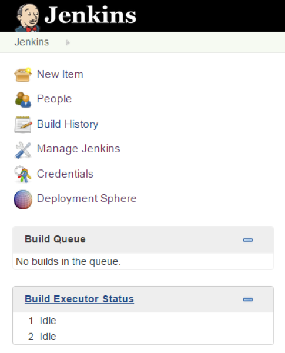
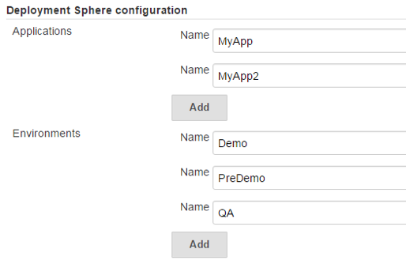
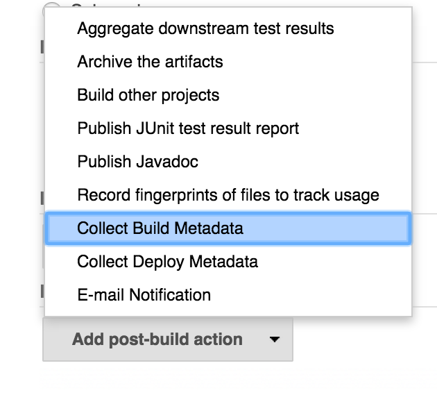
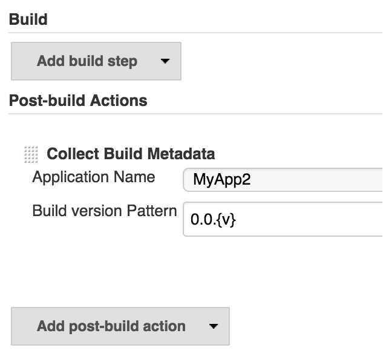
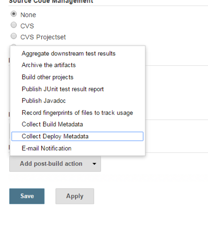
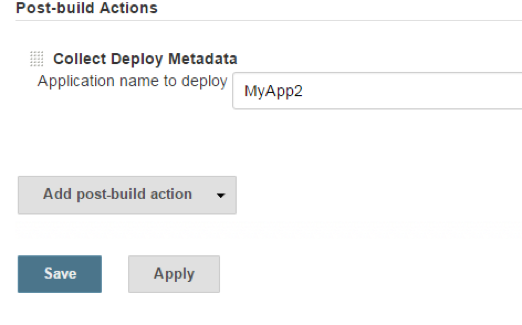
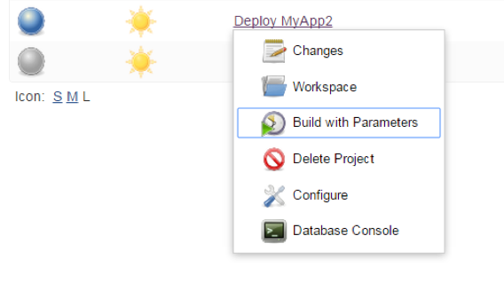
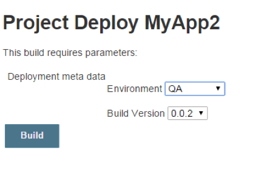
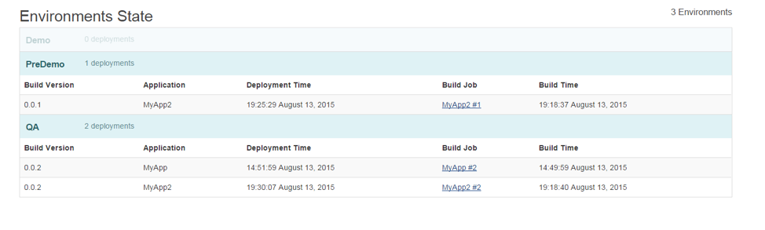

Jenkins plugin to have a bird's eye view of your continuous deployment
pipeline.

# Configuration

1.  Install dependency plugins:
    1.  Open “**Manage Jenkins**”
    2.  Go to “**Available**”
    3.  Find and install [H2 Database
        Plugin](https://wiki.jenkins.io/display/JENKINS/H2+Database+Plugin "H2 Database Plugin")
2.  Install plugin into Jenkins:
    1.  Open “**Manage Jenkins**”
    2.  Go to “**Available**”
    3.  Find and install [Deployment Sphere
        Plugin](https://wiki.jenkins.io/display/JENKINS/Deployment+Sphere+Plugin "Deployment Sphere Plugin")
3.  Restart Jenkins
4.  Additional menu item "**Deployment Sphere**" in the left navigation
    block should appear  
    {height="300"}
5.  Now you need to configure your Jenkins system:
    1.  Open “**Manage Jenkins**”
    2.  Open “**Configure system**”
    3.  Navigate to “**Deployment Sphere configuration**” to add
        **Applications** and **Environments** you're working with  
        {width="300"}

# Features

-   Collects application versions
-   Collects application versions deployments
-   Configures environments
-   Configures applications
-   Provides dashboard of deployed applications versions across
    environments

# Usage

1.  Create any type Jenkins project to collect Build Metadata by adding
    **post-build** action "**Collect Build Metadata**" and select
    **Application** that is being built by current project.  
    {width="300"}
       
    {width="300"}  
    where \*"0.0.
    Unknown macro: {v}

    "\* is a version naming template that could be changed according to
    your convention.
2.  Crate any type Jenkins project to collect Deploy Metadata by adding
    **post-build** action "**Collect Deploy Metadata**" and
    select **Application** that is being deployed by current project.  
    {height="300"}
       
    {width="300"}
3.  Now build your application and go to deploy project  
    {width="300"}
4.  Select environment and application version you'd like to deploy  
    {width="300"}
5.  Now you can check out to what environment and what version of your
    application was deployed  
    

# Roadmap

TODO

# About

This plugin is started as a hack-a-thon at the EPAM Grand Hackathon 2015
in Minks. It is licensed under Apache License, Version 2.0.

# Changelog

TODO
