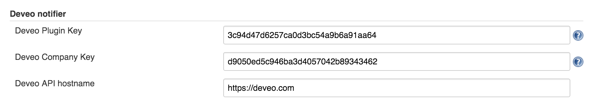
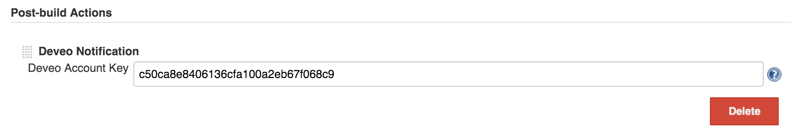

This plugin integrates Jenkins with [Deveo](https://deveo.com/).

The plugin creates events to Deveo from Jenkins builds. The events can
then be seen in the activity feeds of Deveo projects. The plugin
supports Git, Subversion, and Mercurial.

##### Successful build event

##### Failed build event

## Configuring the plugin

To allow Jenkins to send notifications to Deveo, you'll need to
configure two Deveo API keys for your Jenkins instance, namely Plugin
Key and Company Key. To do this, open up Jenkins System Configuration
(Manage Jenkins -\> Configure System). There you'll find the Deveo
notifier section and under it inputs for the two keys. For Plugin Key
you can use the following: 3c94d47d6257ca0d3bc54a9b6a91aa64. You'll find
your Company Key from your Deveo User Preferences (User dropdown menu
-\> Preferences) under API keys. Lastly, fill in the hostname of your
Deveo instance.

After you're done with the global plugin configuration, you'll need to
specify which Deveo account each job should utilize. To do this, open up
Job Configuration (Job -\> Configure) and add a new Deveo Notification
Post-build Action. There you'll need to give the Account Key of the
Deveo account you want the job to utilize. This account is usually a bot
account. To create a bot, navigate to your Deveo project and click on
Settings and bot accounts. Now click on New bot to create a new bot.
Once you've created the bot, its details will be shown to you and you'll
find the bot's Account Key under API keys.

## Changelog

##### Version 1.1.2 (released 18 Dec, 2015)

-   Added support for repositories with slashes in their names.

##### Version 1.1.1 (released 29 Oct, 2015)

-   Fixed SSH repository URL support.
-   Fixed a bug that would cause Deveo authorization to fail due to
    missing account key.
-   Deveo API hostname now defaults to
    [https://app.deveo.com](https://app.deveo.com/).

##### Version 1.1.0 (released 28 Oct, 2015)

-   The plugin is now built against Jenkins version 1.627.
-   Added support for builds with Mercurial as their primary SCM.
-   Build events now map to matching Deveo code reviews (Git only).
-   API version can no longer be configured in Jenkins' global settings.
-   You no longer need to configure Deveo project and repository on a
    job-basis.

##### Version 1.0.2 (released 14 Mar, 2014)

-   Added more detailed help texts for configuration fields.

##### Version 1.0.1 (released 27 Feb, 2014)

-   Added job name to Deveo build event payload.
-   Fixed loading global config on Jenkins startup.

##### Version 1.0.0 (released 14 Feb, 2014)

-   Initial release.
