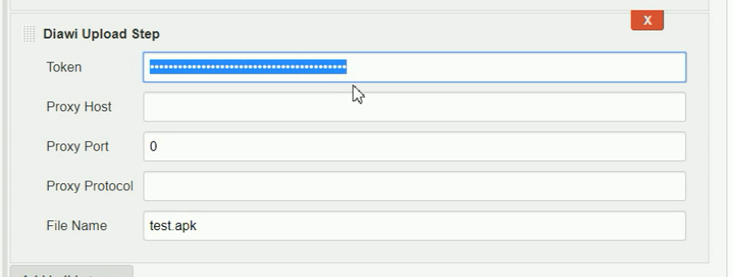

## Features

-   Uploading APK / IPA files to diawi.com
-   Check for upload status.
-   Log the upload link.

## Requirements

### Jenkins

Jenkins [version
1.642.3](https://jenkins.io/changelog-stable#v1.642.3) or newer is
required.

### Diawi.com account

-   A diawi.com account is required to be used for uploading the
    artifact. To create an account, Go
    to [diawi.com](https://www.diawi.com/).
-   Make sure you are logged in to [diawi.com](http://diawi.com/) and
    then use this link to create Diawi API access
    token <https://dashboard.diawi.com/profile/api>. 
-   Once the token is generated, it will be shown on the browser. Make
    sure to save the token as it is only view-able at this time.

### Please note

Feel free to contact <muhammed.adawi@gmail.com> and ask them to fix this
bug!

## Setup

[Check out this YouTube demo](https://youtu.be/C22N7Mj01Lk)

#### Install plugin

Install this plugin via the Jenkins plugin manager.

#### Configure build job

-   in the build section, click add build step and then choose Diawi
    Upload Step.
-   In the Token feild, insert the DIAWI api access token.
-   In File Name, Insert the name of the apk/ipa file.
-   If your jenkins host connects to the internet through a proxy
    server, add the proxy details accordingly, otherwise, leave it blank
    as below.
-   Proxy port and proxy protocol are used if and only if the proxy host
    is defined.  
    {width="500"}
-   if you use the Editable email notification plugin. you can use the
    following syntax to include the diawi link  
    ${FILE,path="DIAWI\_LINKS"}  ( for latest version 1.4,
    use ${FILE,path="filename.diawilink"} instead 

#### Results and Logs

-   Diawi Link to the uploaded artifact

#### Version 1.1 (July 8, 2017)

-   Initial release

#### Version 1.2 (July 15, 2017)

-   issues fixed:

-   -   Stream closed issue.

-   -   relative path.

&nbsp;

-   new functionalities:

-   -   proxy settings

#### Version 1.3(July 17, 2017)

-   new functionalities:

-   -   Save link to DIAWI\_LINKS under the work space directory

#### Version 1.4(Oct17, 2017)

Allowing uploading multiple files:

-   -   File(s) instead of File name now takes multiple files separated
        by comma.
    -   Save links to filename.diawilink under the work space directory.
