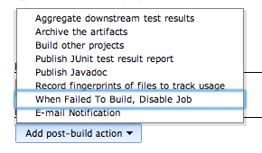
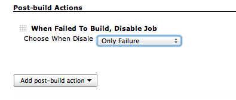
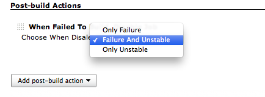
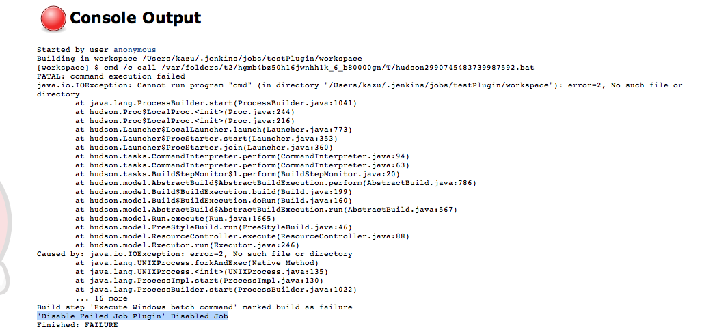
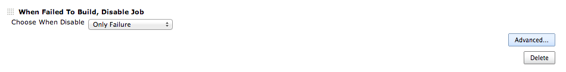
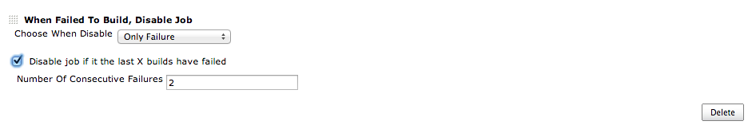

# Description

This Plugin disables a Job when a Build fails.

Please use this when you want to prevent the jobs that are regularly
performed, fail in a row.

 

ビルドが失敗した時に、ジョブを無効にするプラグインです。

定期実行されてるジョブが、続けて失敗することを防ぐ時などに利用して下さい。

# Usage

#### 1. Select "When Failed To Build, Disable Job" in "Add post-build action".

#### 2. Select case you disable Job.

#### 3. When it became selected cases, Job is disabled.

# Advanced

### set option to make disabling of jobs conditional

#### 1. Select "Advanced...".

#### 2. Check "Disable job if it the last X builds have failed" and write "Number Of Consecutive Failures"

# Version history

[TABLE]
