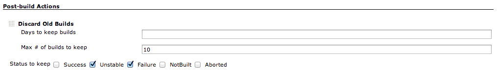
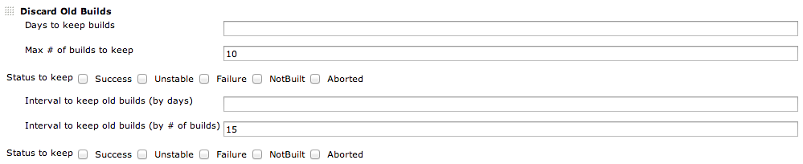
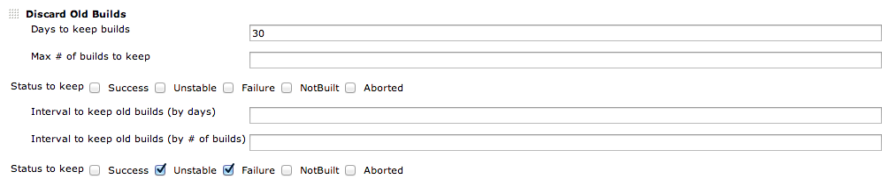

#### Developed by

This plugin provides a post-build step where you can discard old build
results in detailed configuration (ex. keep only builds with specified
status).

# Summary

-   You can configure how to discard builds in more detail than the
    default 'Discard Old Build' function.
    -   Other than \# of builds and days, you can specify build status
        to discard/keep.
    -   For older builds, you can configure interval to keep builds
        (once in a month, once in ten builds...).
    -   You can also use logfile size to decide if delete a old build.

# Usage

### Basic

After installing this plugin, a new post-build step named 'Discard Old
Builds' appears.

'Days to keep builds' and 'Max \# of builds to keep' work as same as
Jenkins core function.  
With checking statuses in 'Status to keep' section, Jenkins will keep
the builds with selected statuses.

-   Last build / last stable build / last successful build are always
    kept.
-   If all the checkboxes are left unchecked, builds with any status are
    kept.

### Advanced

In advanced section, you can configure how to treat the builds which are
older than the criteria specified in basic configuration.  
For old builds, perhaps you don't want to keep all, but sometimes you
want to keep some of them with less frequency.

#### Example1

This configuration shows:

-   Latest 10 builds are kept.
-   Except for the latest 10, one in 15 builds are kept(\#1, \#16,
    \#31,...).

#### Example2

This configuration shows:

-   Builds within 30 days are kept.
-   For builds older than 30 days, only builds with unstable/failure are
    kept.

# TODO

-   Add help text
-   Add dynamic adjust discard order of discard conditions

# Changelog

### 1.05 (released June 27, 2013)

-   Add reg expression checker to discard build
-   Readjust the UI and code logic

### 1.04 (released June 6, 2013)

-   Add logfile size checker to discard build

### 1.03 (released April 12, 2013)

-   Fixed regression related with Jenkins 1.503
    ([JENKINS-17528](https://issues.jenkins-ci.org/browse/JENKINS-17528))

### 1.0 (released January 27, 2013)

-   Initial release.
