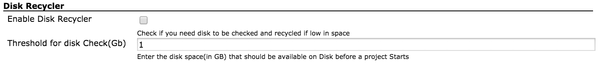

This plugin checks for Disk Space on the slave machine before starting a
build.

If the disk space is below minimum threshold (default 1 Gb ) build will
fail,

One can set the threshold parameter in the Global Configuration , Also
you can choose to delete the workspace if the disk space is low

  
-------------  
**Per-Job Configuration**:   Once installed the Plugin is enabled by
default in every job , you can disable it if you like 

**Job Configuration Example:           **

**Global Configuration :**

Enable Disk Recycler ::      if it's checked  and the disk space is low
for a job , then it will delete everything in the current job workspace
directory,

Threshold for disk check ::  you specify per job disk space requirement
(in Gb ) in this text box  

**Global Configuration Example :**

 

## Change Log

#### Version 0.29 (released Jun 14, 2017)

-   Changes to address issues with workspace cleanup when recycle is
    enabled (Pull\#5)
-   Add Capability to check Disk space every time a Jenkins job starts (
    previously it was using diskusage descriptor which runs once every
    hour)
-   Ensure that the system does not exit incase of error.
