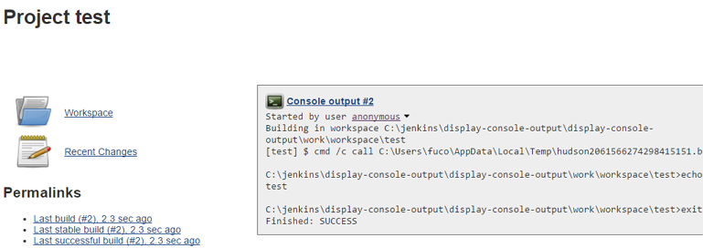

 

 

This plugin adds console output of the last build to the project page.

  

Check [issue
tracker](https://issues.jenkins-ci.org/issues/?jql=component%20%3D%20display-console-output-plugin)
for current open bugs with this plugin.

Key

Summary

T

Created

Updated

Due

P

Status

Resolution

Loading...

Refresh

