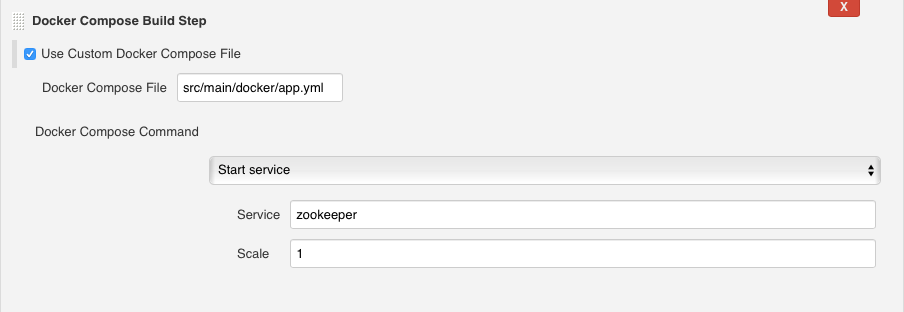
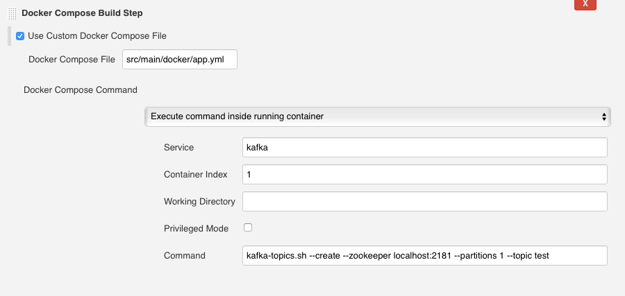
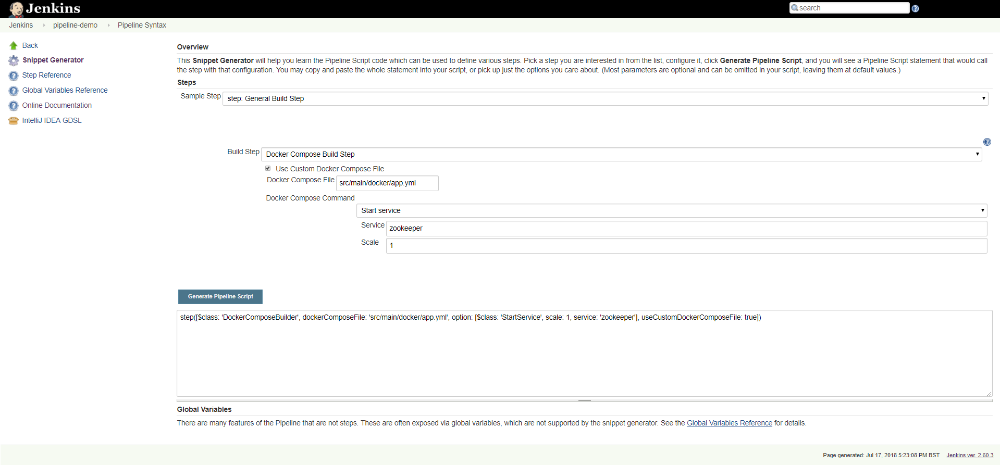

{width="400"}

The Docker Compose Build Step plugin allows the user to run
docker-compose commands as build steps.

For more information about Docker Compose, please check the [Docker
Documentation](https://docs.docker.com/compose/).

  

# Changelog

### Version 1.0 (July 12 2018)

-   Initial version - freestyle job support

## Features

### **Use Custom Docker Compose File**

The **Use Custom Docker Compose File** option is available on all Docker
Compose build steps and is used to select a compose file other than the
default ($WORKSPACE/docker-compose.yml). This option supports both
absolute and relative paths.

### Start/Stop Services

In the case of the **Start service** step, use the **Scale** option to
spin up more than one running instance of a service.

{width="750"}

### Execute Command Inside Running Container

Use the **Container Index** option to select the instance where you want
to run the command.

If the **Working Directory** is left empty, the plugin will use the
default one for the container.

{width="750"}

### Pipeline Support

Use the [Snippet
Generator](https://jenkins.io/doc/book/pipeline/getting-started/#snippet-generator)
to generate a Docker Compose Build step "metastep" for a scripted
pipeline.

{width="750"}

 
