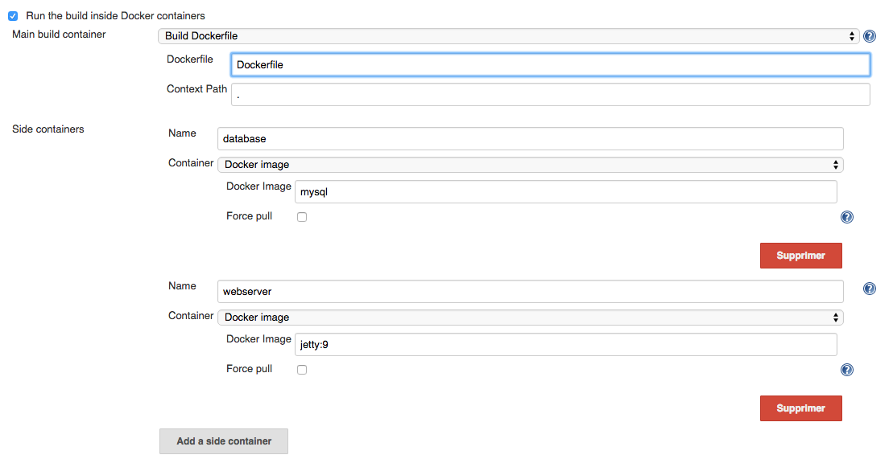

Use Containers to setup build agents, without any constraint on images
you can use.

## Objectives

\- \[✓\] use ANY docker image, without any jenkins-specific prerequisite

\- \[✓\] no SSHD inside container, no JNLP port exposed over the
Internet

\- \[✓\] compose your build *à la* docker-compose with a main build
container and sidecar containers for test database, selenium browser,
etc

\- \[✓\] define container used for the build as a Dockerfile stored in
project SCM - aka "*continuous delivery as code*"

\- \[✓\] support Pipeline

\- \[✓\] rely on docker volumes to offer workspace persistence between
builds

\- \[✓\] extensibility for various docker hosting solutions

## Configuration

In your jobs, new option let you define your build environment as a
combination of Docker images / Dockerfiles   

## History

###### 1.0.2

Fix support for Docker host credentials  
Add support for docker socket bind mount via a dedicated binding
container. This let you run \`docker build\` from your build container

###### 1.0.1

Plugin has been moved to jenkinsci github organization so we can publish
it in public update center

###### 0.5 - proof of concept

This version has been released at DevoxxFrance while we demonstrated the
plugin, so people can give it a try and let us know if it was useful

## Why ?

Why (yet another) Docker plugin ?

Most plugins around use docker as a lightweight virtual machine, but
don't embrace containers paradigm shift and how they impact CI/CD. 

This plugin has been designed as a pure experiment during [Docker Global
Hack Day](https://www.docker.com/community/hackathon). It's under active
development. Plugin authors are CloudBees employees, but the plugin
isn't a CloudBees product, please consider this as individuals public
experiment.

## Read more on [https://dockins.github.io](http://dockins.github.io/)

[http://dockins.github.io](http://dockins.github.io/)

**Diagnostic**

If something goes wrong (sic), please first run Jenkins master with
`-Dit.dockins.dockerslaves.spi.DockerDriver.verbose=true` . This will
dump in build log all docker commands ran by the plugin and help us
understand the issue.

Then, ask for assistance on jenkins-users mailing list and/or report a
bug on [https://issues.jenkins-ci.org](https://issues.jenkins-ci.org/)

## Future

There's many possible improvements / features we'd like to experiment.

-   integrate with Pipeline plugin, especially replace DurableTask by a
    docker based implementation, running docker commands detached (-d)
    and polling using docker API for execution status. Would need some
    way to replace the `sh` step execution
-   consider using a java based docker client for Docker API, so we
    don't rely on running external commands (and related threads usage)
-   integrate with docker orchestrators (amazon ECS, Kubernetes, Hyper\_
    ...) as an alternative backend
-   offer isolated Docker host per build, typically relying on docker
    inside LXD containers.
-   Let build use of docker as part of the build (i.e. bind mount
    docker.sock in build container)
-   experiment with docker volume plugins (flocker) for workspace
    snapshoting and offline browsing of the exact workspace for a
    specific build.
-   experiment pipeline support for volumes
-   support docker 1.12 swarm mode
    [JENKINS-38203](https://issues.jenkins-ci.org/browse/JENKINS-38203)
-   expose docker.sock so build can run \`doker build\` (aka
    "inception")
    [JENKINS-37088](https://issues.jenkins-ci.org/browse/JENKINS-37088)
