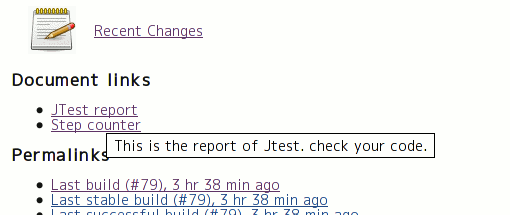
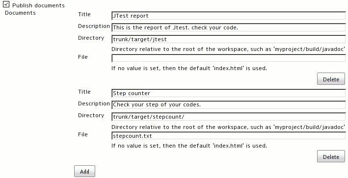

## What does this do?

This plugin allows you to publish your documents that are created in the
build steps as links on the project page.

## Configuration

### Project configuration

#### FreeStyle project

#### M2 project

If your project is M2 style, then you have to configure each modules.
You can see the links on the module pages, not project page.

## History

##### Version 0.6.1 (Mar 5, 2016)

-   FIXED: problems when disabling / uninstalling maven-plugin
    ([JENKINS-30766](https://issues.jenkins-ci.org/browse/JENKINS-30766))

##### Version 0.6 (Sep 28, 2013)

-   added a feature to publish artifacts as documents
    ([JENKINS-19456](https://issues.jenkins-ci.org/browse/JENKINS-19456))

##### Version 0.5 (Oct 19, 2011)

-   Added German I18N

##### Version 0.4 (Sat 15, 2011)

-   Added "archive recursively" option.
    ([JENKINS-8507](https://issues.jenkins-ci.org/browse/JENKINS-8507))

##### Version 0.3 (Feb 15, 2010)

-   Update code for more recent Hudson.

##### Version 0.2.2 (Jul 25, 2009)

-   Check if user has Job.CONFIGURE, not ADMINISTER when configuring
    project.

##### Version 0.2.1 (Jul 20, 2009)

-   Replaced deprecated classes.
-   Fixed a bit.

##### Version 0.2 (Jul 19, 2009)

-   Supported M2 project.

##### Version 0.1 (Jul 11, 2009)

-   First release.
