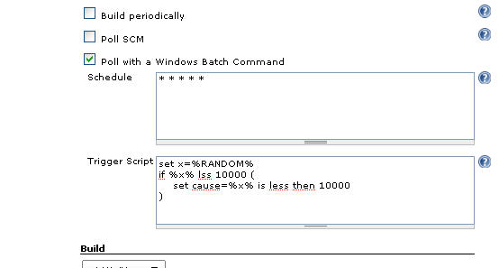

This plugin allows to trigger a build with a DOS script.

# Description

The script will run according to the schedule you enter.  
When the script sets the ***cause*** variable to something other than
the empty string a build will be started (with the given 'cause').

**Caution**: This plugin always uses the default workspace, even if a
custom workspace was defined.

# Screen Shot

|                                                                                                                          |
|--------------------------------------------------------------------------------------------------------------------------|
|  |

_(After\ making\ this\ example\ I\ discovered\ that\ the\ DOS\ %RANDOM%\ construct\ is\ far\ from\ random,\ don't\ use\ it\ at\ home)

# Change Log

### V1.23 @ 08-20-2011

-   Fix help link
-   Internal restructuring

### V1.21 @ 06-02-2011

...

### V1.0 @ 08-01-2010

-   Initial release

# Author

Tom Brus
