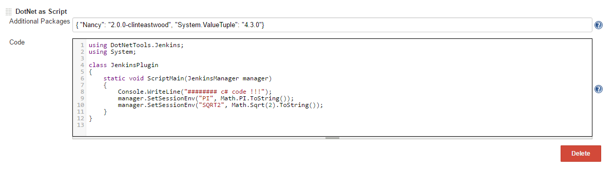

This plugin, enables you to run c\# code as a normal build step.

# DotNet as script plugin for Jenkins

## Features

-   Run your c\# code "dotnet core" like a script language.
-   Multiplatform plugin (as dotnet core is now).
-   Based in your c\# code this plugin creates a dotnet core project
    with all the required information.
-   Add custom nuget packages in a JSON format.
-   The code is compiled again when it changes or the packages changed.
-   For future executions of unchanged code the compiled executable will
    be used.
-   Inject environment variables for the next build step.

## Capture:

## Requirements:

-   You need to have installed the dotnet core
    sdk <https://www.microsoft.com/net/download/core>.
-   The minimun version is the 1.0 (preview versions will not work).

#### Version 0.1

-   Initial Release

 
