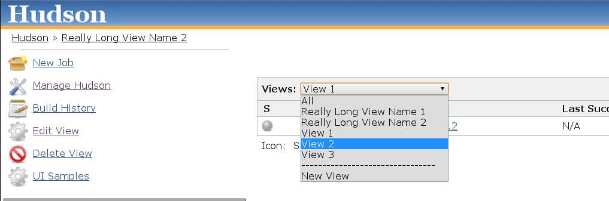
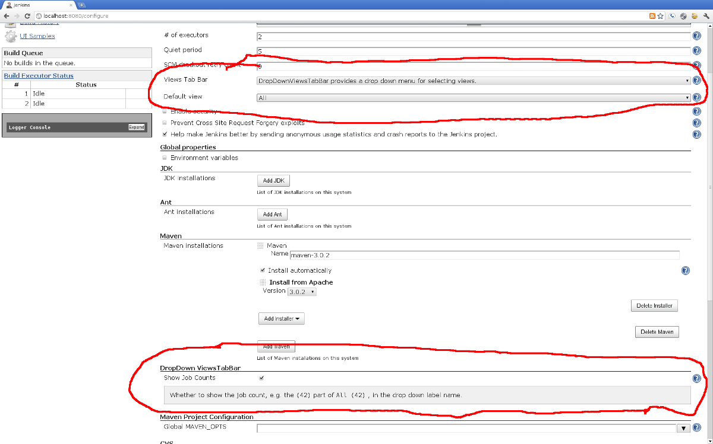

# DropDown ViewsTabBar Plugin

This plugin provides an alternate rendering of the Views bar which runs
along the top of all views. This plugin is useful for instances which
have a very large number of views and want a compact
rendering.  

To use the DropDown ViewsTabBar go to **Manage Jenkins** \> **Configure
System**, select it in the **Views Tab Bar** drop down box and save the
configuration.

Some users report performance problems with this plugin enabled under
the following conditions: Nested Views Plugin enabled, many Views
created, those Views use complex regex in order to filter jobs, and this
plugin configured to show job counts (configurable in System
Configuration page).

  
  

------------------------------------------------------------------------

 

### Changelog

#### 1.7 (released 2015-10-16)

-   Added possibility to filter empty views in dropdown list
-   Fixed job counts display
-   Changed minimal Jenkins version to 1.546

#### 1.6 (released 2012-07-22)

-   Fixed
    [JENKINS-13114](https://issues.jenkins-ci.org/browse/JENKINS-13114) -
    dropdown views taskbar: error when saving jenkins config page

#### 1.5 (released 2012-04-27)

-   Fixed
    [JENKINS-13048](https://issues.jenkins-ci.org/browse/JENKINS-13048)
    dropdown-viewstabbar: cannot save checkbox 'Show Job Counts'

#### 1.4 (released 2011-08-16)

-   Fixed
    [JENKINS-10640](http://issues.jenkins-ci.org/browse/JENKINS-10640),
    compatibility release for Jenkins 1.425 .. new code in that release
    changed a lot of existing behavior, and we're still playing catch
    up. There are some other problems with this Jenkins release that
    will be addressed in future releases.

#### 1.3 (released 2011-06-22)

-   Fixed
    [JENKINS-10072](http://issues.jenkins-ci.org/browse/JENKINS-10072),
    Add option for disabling the count in the dropdown tab name

#### 1.2 (released 2011-06-15)

-   Show total jobs in each view (thank you fredg02)
    -   e.g. View Name (18)

#### 1.1 (released 2011-02-23)

-   Fixed
    [JENKINS-8861](http://issues.jenkins-ci.org/browse/JENKINS-8861)
-   Reassigned
    [JENKINS-8860](http://issues.jenkins-ci.org/browse/JENKINS-8860)
-   Closed
    [JENKINS-8859](http://issues.jenkins-ci.org/browse/JENKINS-8859)

#### 1.0 (released 2011-01-20)

-   fully I18N
-   initial implementation
