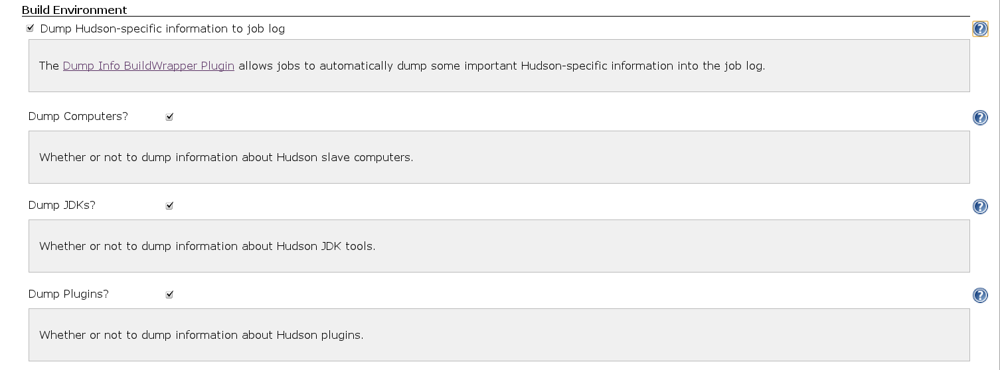
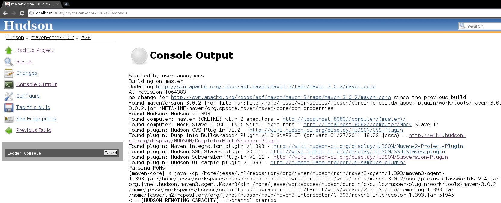

# DumpInfo BuildWrapper Plugin

  

Dumps vital information about the Hudson instance into the job log. This
plugin is useful for historical and audit purposes, where you can see
what versions of Hudson, slaves, and plugins were around at the time of
a build.

  

| Configuration Page                                                                                                                 | Job Log Page                                                                                                                    |
|------------------------------------------------------------------------------------------------------------------------------------|---------------------------------------------------------------------------------------------------------------------------------|
|  |  |

  

------------------------------------------------------------------------

  

### Changelog

#### 1.0 (released 2011-01-27)

-   fully I18N
-   initial implementation
