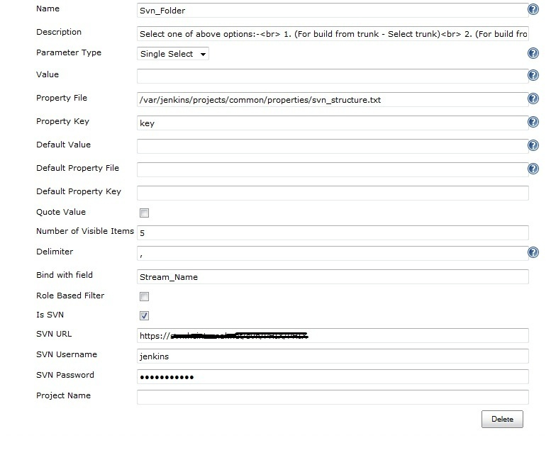
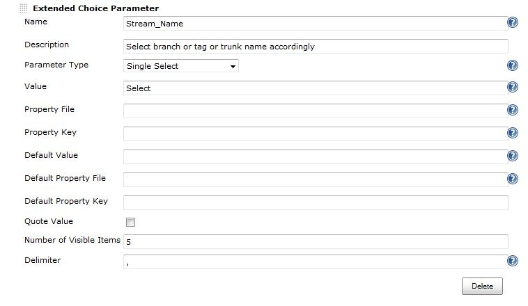
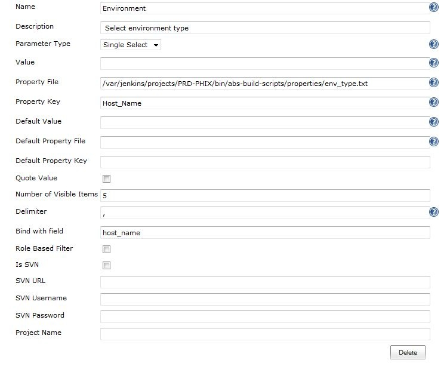
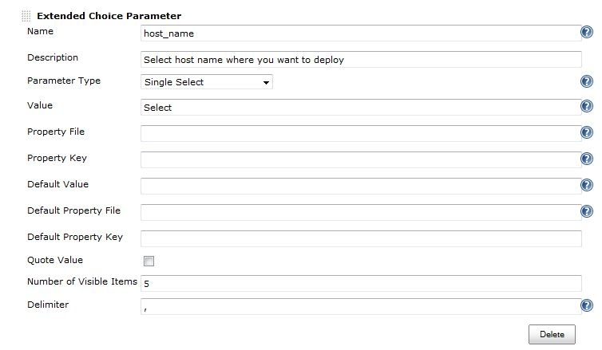

The current version of this plugin may not be safe to use. Please review
the following warnings before use:

-   [Password stored in plain
    text](https://jenkins.io/security/advisory/2020-02-12/#SECURITY-1560)

Adds Dynamic functionality to Extended Choice parameter plugin.

### Functionality usage

This plugin extends the functionality of [Extended Choice Parameter
plugin](http://localhost:8085/display/JENKINS/Extended+Choice+Parameter+plugin)
and adds dynamic loading to it. This plugin supports two features;

-   **Automatic populate dropdown options for branch/tag/trunk names** :
    While selecting source code location you need to enter source code
    branch/tag/trunk name accordingly now Jenkins will automatically
    populate all those thing based on your selection. Below are the
    screenshots to configure this plugin for this feature  
      
      
    To setup this plugin with svn you need to enter the basic details as
    we did in extended-choice-parameter-plugin after that enter "Bind
    with field" field name so that based on your selection output
    content of this field get changed and tick "IS SVN" check-box and
    enter "SVN URL" with which it will work , "SVN Username" and "SVN
    Password" to access this repository. Rest of the option are not
    needed for this functionality.  
    Property file in my case i have used "svn\_structure.txt" which
    contains "key=trunk,tags,branches" based on user selection plugin
    goes into that location and list the names of the list under that
    selection.  
    (\*PS: "Bind with field" currently works with string parameter and
    Extended-choice-parameter-plugin. So please select on of them.)
-   **Populate Host name based on your role** : Based on your role in
    Jenkins it will show you only those assigned host name list and type
    against your role. Below are the screenshot to configure this plugin
    for this feature  
      
    

To setup this plugin with this functionality you need to enter the basic
details as we did in extended-choice-parameter-plugin after that enter
"Bind with field" field name so that based on your selection output
content of this field get changed.Rest of the option are not needed for
this functionality.

Property file in my case i have used "env\_type.txt" which contains
"Host\_Name=QA,DEV,SIT,Staging,Prod" based on your selection plugin will
look into the same dir under which i have placed "env\_type.txt" in my
case it is
"/var/jenkins/projects/PRD-PHIX/bin/abs-build-scripts/properties" to get
user selected input.txt i.e if user select QA then it will look for
QA.txt under same dir with same property key that you have mentioned for
file "env\_type.txt" in my case it is "Host\_Name";

**To make this plugin to work with your role in Jenkins** you need to
tick "Role Based Filter" in configuration page as shown above. This
plugin will look for roles in global roles and project roles based on
your configuration.

-   **If you specify the "Project Name" in configuration page** then
    this plugin will look for property file content + "\_" + "Project
    Name" means if you select QA then roles become "QA\_Project Name"
    whatever project name you have specify in the field like if project
    name is ABC then role become QA\_ABC only those users who has this
    role will see this option in jenkins job else only select option
    will be visible at their end.
-   **If you don't specify the "Project Name" in configuration page**
    then plugin will look for "QA" role and other roles respectively
    only.

(PS: Property file has server names like QA.txt will have only QA server
list, DEV.txt will have only DEV server list.)

(\*PS: "Bind with field" currently works with string parameter and
Extended-choice-parameter-plugin. So please select on of them.)
