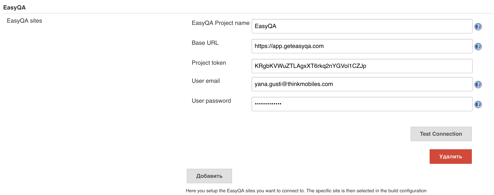
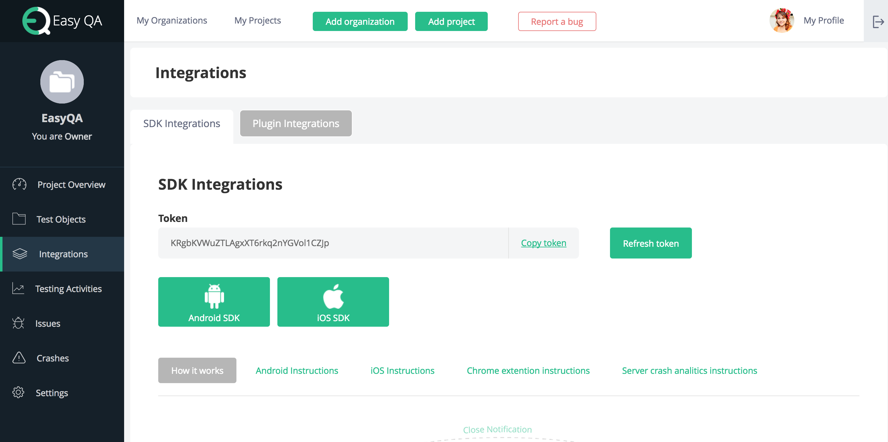
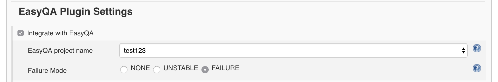
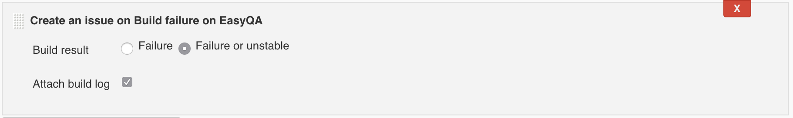

This is a plugin for Jenkins that aims for providing support
for [EasyQA](https://geteasyqa.com/) inside [Jenkins](http://jenkins-ci.org/). 

  
 

# General

The main feature is to create an issue on
[EasyQA](https://geteasyqa.com/features/catch-crashes/) [Test Management
Tool](https://geteasyqa.com/how-to/what-is-easyqa/) when the build fails
in Jenkins.  

## Configuration

#### Global configuration

To start using this plugin, EasyQA sites should be configured on the
global configuration page. For each job a separate project can be
selected, and specific options can be set. Here you need to specify:

{width="500"}

-   *EasyQA Project name*
-   *Base URL* (if you use *EasyQA Cloud*, the **base URL** is -
    <https://app.geteasyqa.com/>)
-   *Project token* (you can find in on the **Integrations** page within
    your project in EasyQA)

{width="500"}  

-   User email - the email of registered EasyQA user
-   User password -  the password of registered EasyQA user

#### Project configuration

{width="500"}

When you have set up your EasyQA site(s) in the global configuration you
can enable the integration on the job configuration page. You select the
project you want to integrate with and the failure mode.

## Create an issue on EasyQA after Build failure

{width="500"}

Add a post-build action - Create an issue on Build failure on EasyQA.
Here you can choose for what result do you want to create an issue and
if you want to attach build log file.

## Version history

### Version 1.0 (1 June, 2017)

-   Initial release
