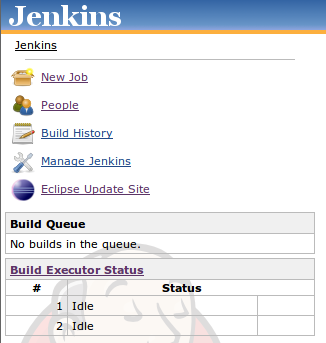

This library plugin combines Eclipse update sites from all the installed
plugins and expose it as a single update site. This plugin does not
provide user-visible features by itself, but rather it is meant to be
used by other plugins as a library.

### User Guide

When this plugin is installed, you'll see the "Eclipse Update Site" link
in the Jenkins top page:

This URL itself is the update site URL that you can enter into Eclipse
(click this link from the browser and you'll see more detailed
instructions and what's in it.) This single update site contains all the
features and Eclipse plugins contributed by all the Jenkins plugins
installed in your system. In this way, you only need to manage one
repository, as opposed to one per Jenkins plugin.

### Developers Guide for Using This Plugin

Plugins who wish to expose Eclipse update site from Jenkins can take
advantages of this plugin by following these steps:

1.  have your plugin depend on this plugin
          <dependencies>
            <dependency>
              <groupId>org.jenkins-ci.plugins</groupId>
              <artifactId>eclipse-update-site</artifactId>
              <version>1.0</version>
            </dependency>
          </dependencies>

2.  bundle files that constitute an Eclipse site into the
    `/eclipse.site/` directory of your `*.jpi` file. The following POM
    snippet (taken from [Jenkow
    plugin](https://wiki.jenkins.io/display/JENKINS/Jenkow+Plugin)) shows
    how to do this:
          <build>
            <plugins>
              <plugin>
                <groupId>org.apache.maven.plugins</groupId>
                <artifactId>maven-dependency-plugin</artifactId>
                <executions>
                  <execution>
                    <id>unpack</id>
                    <phase>generate-resources</phase>
                    <goals>
                      <goal>unpack</goal>
                    </goals>
                    <configuration>
                      <artifactItems>
                        <artifactItem>
                          <groupId>com.cisco.step.jenkins.plugins</groupId>
                          <artifactId>com.cisco.surf.jenkow.site</artifactId>
                          <version>${project.version}</version>
                          <type>zip</type>
                          <overWrite>true</overWrite>
                          <outputDirectory>${project.build.directory}/generated-resources/eclipse.site</outputDirectory>
                        </artifactItem>
                      </artifactItems>
                    </configuration>
                  </execution>
                </executions>
              </plugin>
              <plugin>
                <groupId>org.jenkins-ci.tools</groupId>
                <artifactId>maven-hpi-plugin</artifactId>
                <configuration>
                  <webResources>
                    <resource>
                      <directory>${project.build.directory}/generated-resources</directory>
                    </resource>
                  </webResources>
                </configuration>
              </plugin>
            </plugins>
          </build>

That's it.

# Changelog

### Version 1.2 (Sep 27, 2012)

-   The plugin wasn't serving `p2.index` file.

### Version 1.1 (Sep 11, 2012)

-   Fixed access check so that anonymous users can access the update
    site.
