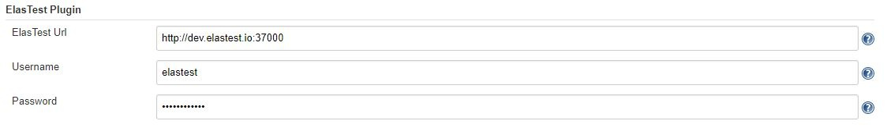
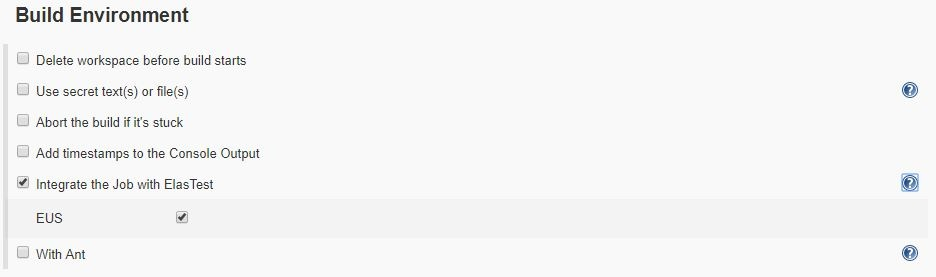

# Description

This plugin allows Jenkins to be integrated with
[ElasTest](http://elastest.io/), an elastic platform to ease testing.

# Features

With this plugin you will be able to:

-   Associate a Jenkins Job with an ElasTest TJob. You can create a new
    project on ElasTest or to use an existing project.
-   Use a SUT managed by ElasTest (a SUT deployed by ElasTest or not)
-   Send the logs of a build to ElasTest for advanced analyze (ElasTest
    provides the **Log Analyzer**, a powerfool tool for finding what you
    want in the vast flood of logs).
-   Send logs and metrics of a SUT started in a Jenkins Job to ElasTest.
-   Set ElasTest as your web browsers provider for your end to end
    tests.
-   Request others test support services from ElasTest (ESS, EMS,...).
    For more information about this, visit the official
    ElasTest [documentation](https://elastest.io/docs/jenkins/).

# Setup

## Global Configuration

To set the configuration of the ElasTest plugin, navigate to 'Manage
Jenkins \> Global Tool Configuration' and search the section labeled
with 'ElasTest Plugin'.

{width="1124"
height="173"}

In the image avobe you can see the following fields:

-   **ElasTest URL:** URL where ElasTest is deployed. This field is
    mandatory.
-   **Username:** username used to get access to ElasTest. If this field
    is filled, the password will be mandatory.
-   **Password: ** password to access to ElasTest.

If you want to use a user's credentials to access ElasTest, it will be
necessay to fill the "Username" and "Password" fields. Is you fill one
of them and leave the other empty, communication with ElasTest will be
done without authentication.

# Usage

You can use the ElasTest plugin if you use Jobs based on "Freestyle
project" or "Pipeline" templates.

## With Freestyle project

If you prefer to work with Freestyle projects, you should look at the
Job Configuration Page in the section "Build environment" and check the
option "Integrate the Job with ElasTest". With this, you will have
activated the shipping logs to ElasTest. If in addition to this, you
want to use the browser provided by ElasTest, you must check the EUS
field.

{width="845"
height="250"}

In this type of projects, the ElasTest plugin not offers all it's
functionalities.

## With Pipeline

If you prefer to work with Jobs based on Pipeline templates instead, you
must add the next step to your pipeline script to wrap the rest of the
pipeline.

**Pipeline script**

``` syntaxhighlighter-pre
node {
    elastest() {
        stage ('Executing test') {
        ............
        echo 'Cloning repository'
        ............
        echo 'Running test'
        ............
        }
    }
}
```

Above we have shown you a basic example without using any plugin option.
Here is an example with all the plugin options and below the
descriptions of them:

**Pipeline script**

``` syntaxhighlighter-pre
node {
    elastest(tss: ['EUS'], surefireReportsPattern: '**/target/surefire-reports/TEST-*.xml', project: 'jenkins_project', sut: 5, monitoring: true, sutParams: ['PARAM_NAME': 'value']) {

        stage ('Executing test') {
        ............
        echo 'Cloning repository'
        ............
        echo 'Running test'
        ............        
        }
    }
}
```

The meaning of each parameter is the following:

-   **surefireReportsPattern:** will contain the path where the xml
    files containing the test results are stored and which will be used
    by ElasTest to display the test information. We explain this in more
    detail [here](https://elastest.io/docs/testing/unit#xmlAndtestResultsPath).
-   **project:** is used to indicate the name of the ElasTest project
    where the TJob associated with Jenkins Job will be created. This
    field is optional and if it is not used, a project will be created
    with the same name as the Job.
-   **sut:** allows you to select a Sut created in ElasTest against
    which to execute the job, indicating its id.
-   **tss:** is used to indicate to ElasTest that the job needs to use
    the EUS service to use a web browser.
-   **monitoring:** used to send or not the Sut monitoring traces to
    ElasTest.
-   **sutParams:** used to send parameters to a SUT on ElasTest.

## Advanced documentation

If you want to see some advance examples and more complete
documentation, visit the official ElasTest
[documentation](https://elastest.io/docs/jenkins/).

# Change Log

### Version 1.1.0 (Apr 29, 2019)

-   Now as many executions of a TJob are saved in ElasTest as indicated
    in the "Max \# of builds to keep" field of Jenkins Job.
-   Send date with the build logs to ElasTest
-   Compatible with ElasTest 1.5.0

### Version 1.0.1 (Feb 28, 2019)

-   Fix some issues
-   Update REST client
-   Compatible with ElasTest 1.0.2

### Version 1.0.0 (Feb 12, 2019)

-   Request for any TSS provided by ElasTest
-   Send metrics and logs of a SUT started from Jenkins to ElasTest
-   Use the ElasTest plugin on Jenkins's slaves
-   Associate the Job with a existing project/TJob on ElasTest
-   Use a SUT managed by ElasTest
-   Send params to be used by a SUT on ElasTest
-   Fix several issues

### Version 0.10 (July 23, 2018)

-   Now you can send the surefire test reports from Jenkins to ElasTest

### Version 0.9.1 (May 09, 2018)

-   First release
-   Send the build logs to ElasTest
-   Set ElasTest as your web browsers provider
