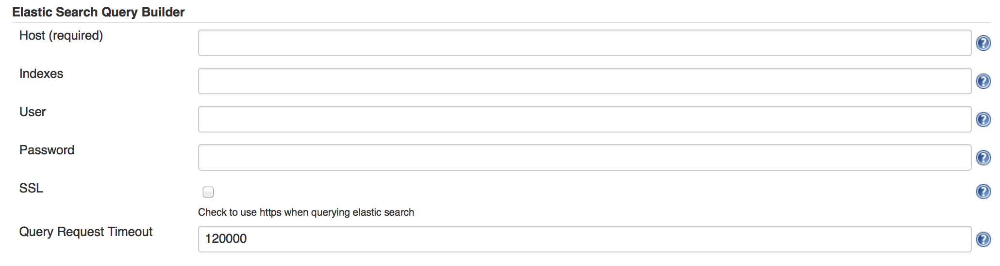
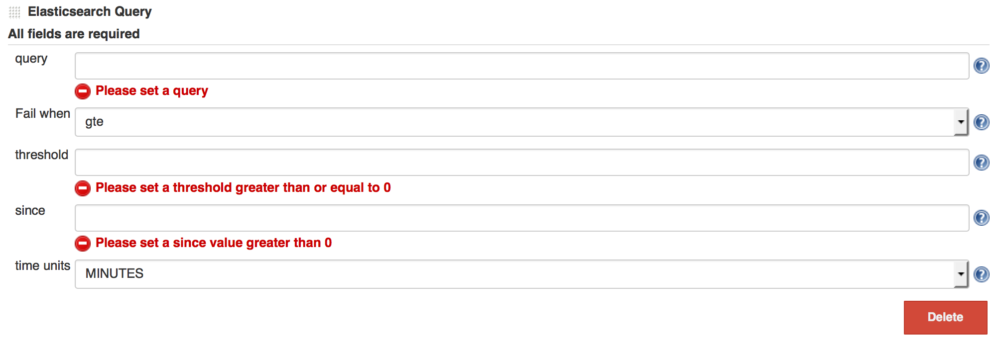

Fails a build based upon an
[elasticsearch](https://www.elastic.co/products/elasticsearch) query

# About this plugin

This came from a need to alert based on data stored on in elastic
search; in particular logstash data. ELK users who also use Jenkins now
have FOSS capabilities similar to that of
[watcher](https://www.elastic.co/products/watcher) or
[splunk](http://www.splunk.com/).

# Configuration

Once elastic search query plugin is installed the configuration has two
parts.

Global:

{width="799"
height="215"}

Host is the only required field.

Job:

{width="798"
height="276"}

All fields are required.

# Change Log

### Version 1.2 (Dec 13, 2015)

-   updated messaging and improved validation stemming from writing wiki
    page

### Version 1.1 (Dec 13, 2015)

-   Initial commit
