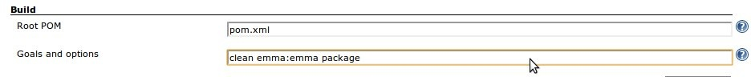
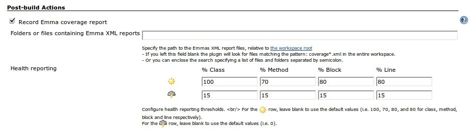
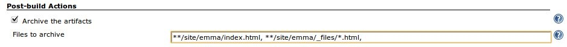

This plugin allows you to capture code coverage report from
[Emma](http://emma.sf.net/). Jenkins will generate the trend report of
coverage.

This functionality is replaced by the [JaCoCo
Plugin](http://localhost:8085/display/JENKINS/JaCoCo+Plugin) now!

## Usage with Maven2

1\. With maven 2.2.x you don't need to add anything to your POM file.

2\. Add the "emma:emma" goal to your build to generate Emma reports.

### Jenkins Configuration

1.- Add "emma:emma" goal to your maven Build
  
2.- Enable recording Emma coverage report, and configure it.  
  
3.- Optional: if you want to store html coverage files generated by
Emma, configure a post-build action to do that.


## Usage with ANT

1.- Create the taskdef and other necessary information for ANT:

``` syntaxhighlighter-pre
 <property name="coverage.dir" value="${basedir}/coverage" />
 <property name="emma.dir" value="/usr/bin/emma" />
 <property name="src.dir" value="${basedir}/src/"/>
 <property name="class.dir" value="${basedir}/class/"/>
 <property name="instrumented.dir" value="${basedir}/inst/"/>
 <path id="emma.lib">
     <fileset dir="${emma.dir}">
         <include name="*.jar"/>
     </fileset>
 </path>
   
 <taskdef resource="emma_ant.properties" classpathref="emma.lib" />
```

*coverage.dir* is the location emma will generate the report data to,
and *emma.dir* should be the location of the emma binaries on your
system. *src.dir* is the location of your source files, *class.dir* is
the location of your binary files to be instrumented, and
*instrumented.dir* is the location to store the instrumented binaries.

2.- Tell emma where to find the code to instrument, and the new location
to place that code. Note that you must instrument the code before
running tests on it.

``` syntaxhighlighter-pre
 <emma enabled="true">
     <instr instrpath="${class.dir}" destdir="${instrumented.dir}" metadatafile="${coverage.dir}/metadata.emma" merge="true">
         <filter excludes="au.com.jenisys.view.*"/>
     </instr>
 </emma>
```

Use *instrpathref* instead of *instrpath* in conjunction with a
previously-defined *path* for more complex setups. Use the *filter*
nested element to include or exclude certain code from being
instrumented. For more information on the *instr* element, see
<http://emma.sourceforge.net/reference/ch02s03.html>

3.- After the instrumented code has been run, tell emma how to prepare
the reports:

``` syntaxhighlighter-pre
 <emma enabled="true" >
     <report sourcepath="${src.dir}" >
         <fileset dir="${coverage.dir}" >
             <include name="*.emma" />
         </fileset>

         <xml outfile="${coverage.dir}/coverage.xml" depth="method"/>
     </report>
 </emma>
```

This will generate an xml report, to the method depth of detail. For
more information on the report element, see
<http://emma.sourceforge.net/reference/ch02s04.html>

## Change Log

#### Version 1.28 (May 21, 2012)

-   Do not sort "Total" row.
-   Sort line numerically.
-   Don't include jobs which doesn't have a coverage in dashboard.

#### Version 1.27 (May 5, 2012)

-   Enable development in Eclipse under M2E plugin ([pull request
    \#2](https://github.com/jenkinsci/emma-plugin/pull/2)).
-   Failed to load
    hudson.plugins.emma.portlet.grid.EmmaBuilderGrid$EmmaGridDescriptor
    ([JENKINS-12447](https://issues.jenkins-ci.org/browse/JENKINS-12447)).
-   Failed to load
    hudson.plugins.emma.portlet.chart.EmmaBuilderTrendChart$DescriptorImpl
    ([JENKINS-8839](https://issues.jenkins-ci.org/browse/JENKINS-8839)).
-   Emma plugin causes maven release job to fail
    ([JENKINS-10236](https://issues.jenkins-ci.org/browse/JENKINS-10236)).

#### Version 1.26 (Oct 18, 2011)

-   Fixed broken image link on config screen.
-   expand job parameters for report search path
    ([JENKINS-11351](https://issues.jenkins-ci.org/browse/JENKINS-11351)).
-   bumped dashboard plugin.
-   added test class.

#### **Version 1.25 (May 11, 2011)**

-   Fixed a NPE that could be thrown when parsing fails due to malformed
    coverage.xml files.

#### **Version 1.24 (Feb 8, 2011)**

-   Dashboard portlets. Emma portlets for the Dashboard view plugin, a
    grid and a trend chart.

#### Version 1.23 (unreleased)

#### Version 1.21 (Sep 11, 2010)

-   Fixed deprecated API.
-   Added Japanese localization.
-   Restored the floatingBox.jelly which was deleted in previous
    version.([JENKINS-7383](https://issues.jenkins-ci.org/browse/JENKINS-7383))
-   Help file is missing, so deleted the
    link.([JENKINS-7381](https://issues.jenkins-ci.org/browse/JENKINS-7381))
-   Added enlarge link.
-   Removed refresh from coverage
    pages.([JENKINS-7428](https://issues.jenkins-ci.org/browse/JENKINS-7428))

#### Version 1.20 (Mar 18, 2010)

-   Improve Styling

#### Version 1.16 (Mar 09, 2010)

-   Fixed sort in tables

#### Version 1.12 (Feb 21, 2010)

-   Support for multimodule projects
-   Able to automatically look for `coverage.xml` files in the workspace
-   Internationalization
-   Spanish translation

#### Version 1.10 (Jun 9, 2009)

-   Remote API improvement
    ([patch](http://www.nabble.com/Adding-Remote-API-support-to-findbugs-and-emma-plugins-td23819499.html))

#### Version 1.9 (Apr 6, 2009)

-   Emma plugin now works with the Maven2 project type
    ([JENKINS-3424](https://issues.jenkins-ci.org/browse/JENKINS-3424))
