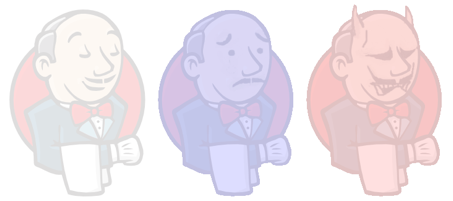

This funny plugin changes the expression of Mr. Jenkins in the
background when your builds fail.

The plugin is maintained by [Masanobu
Imai](http://d.hatena.ne.jp/masanobuimai/).

Once installed, you need to enable this on per-job basis.

## Configuration

To enable this feature for a job, go to the job configuration page,
click *Add post-build action* and select *Emotional Jenkins* from the
list.

## Screenshot

## 
