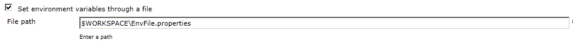

This plugin enables you to set environment variables via a file. The
file's format must be the standard [Java property file
format](http://en.wikipedia.org/wiki/.properties).

Superseded by the [EnvInject
Plugin](http://localhost:8085/display/JENKINS/EnvInject+Plugin)?

The property file is always retrieved from the file system of the
Jenkins master node, even in distributed setups with slave nodes.

You can reference already defined environment variables both to specify
the path to the property file, in a job's configuration, and in property
values, in the property file.

  

When referencing properties you must always use the syntax
**$EnvVarName**, regardless of the operating system where Jenkins is
running.

Here is an example of a property reference in EnvFile's configuration:

  

Note: You can reference environment variables already defined by the
SetEnv plugin.

  

#### Changelog

##### Version 1.2 (8/5/2011)

-   Update for Jenkins
-   Japanese localization

##### Version 1.1 (10/20/2010)

-   Fixed serialization issue.
    ([JENKINS-6595](https://issues.jenkins-ci.org/browse/JENKINS-6595))

##### Version 1.0 (01/23/2010)

-   Added functionality to resolve variables against hudson-variables.

##### Version 0.9 (01/22/2010)

-   Initial release.
