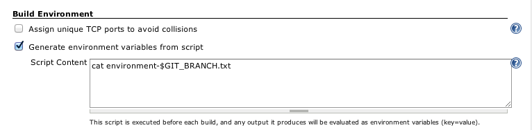
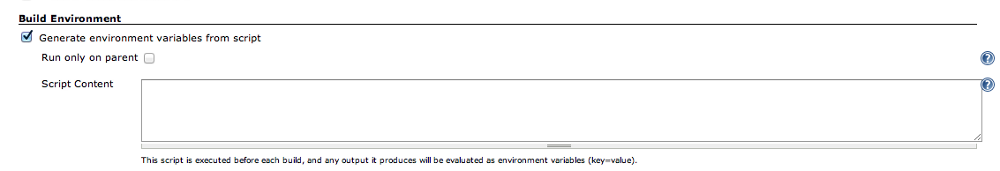

Allows you to run a script before each build that generates environment
variables for it.

## Table of Contents

## Description

Environment Script Plugin allows you to have a script run after SCM
checkout, before the build. If the script fails (exit code isn't zero),
the build is marked as failed.  
Any output on standard out is parsed as environment variables that are
applied to the build. It supports "override syntax" to append paths to
PATH-like variables (through
[EnvVars.override](http://javadoc.jenkins-ci.org/hudson/EnvVars.html#override(java.lang.String,%20java.lang.String))
in Jenkins).

Some information about how it runs:

-   It runs **after** SCM checkout, so you can refer to files from your
    SCM of choice.
-   Matrix builds are supported, and the script runs on each of the
    build combinations (sub-builds, or whatever you call them), **not**
    on the 'master' flyweight task that kicks off the other ones.
-   It supports "override" (through
    [EnvVars.override](http://javadoc.jenkins-ci.org/hudson/EnvVars.html#override(java.lang.String,%20java.lang.String)))
    syntax for appending to PATH-like variables:
    `PATH+myuniqueidentifier=/foo` is the same as PATH=$PATH:/foo in
    shell-script (notice the : is added automatically).
-   If you want to fail a build from the script, just exit with status
    code 1.
-   Support unix and windows scripts.

### Setup

To enable this plugin, go to the configuration page of the job you care
about, and check the box named
`Generate environment variables from script`.

#### Regular job



In your script, just print "FOO=bar" to the standard output to set that
variable.

``` syntaxhighlighter-pre
echo VARIABLE1=Hello World
```

If you want to append to an existing PATH-style variable, you can do:

``` syntaxhighlighter-pre
echo PATH+unique_identifier=/usr/local/bin
```

Otherwise, you're free to do whatever your heart desires in this script
- `cat` a file, run a script in some other language from your project's
source tree, etc.

#### Matrix job



Matrix jobs are pretty much the same as regular jobs, except you get a
new checkbox: `Run only on parent`. If you enable this option, the
script will only run on the matrix "parent" job, and not on the
individual "configuration builds" (sub-builds). The environment
variables will still be propagated to the children.

This option comes in handy if you need to do something like generate a
shared version number based on a timestamp - the code will only run
once, but all the different configurations will get the variable. Here's
an example - note that **ONLY** $VERSION is seen by the jobs, not
$base\_version and $unix\_time.

``` syntaxhighlighter-pre
base_version=$(cat version.txt)
unix_time=$(date +%s)
echo VERSION=${base_version}-${unix_time}
```

## Known issues

type

key

summary

assignee

reporter

priority

status

resolution

created

updated

due

Data cannot be retrieved due to an unexpected error.

[View these issues in
Jira](http://issues.jenkins-ci.org/secure/IssueNavigator.jspa?reset=true&jqlQuery=component%20=%20environment-script-plugin%20AND%20project%20=%20JENKINS%20AND%20resolution%20=%20Unresolved%20ORDER%20BY%20updated%20DESC&tempMax=1000&src=confmacro)

## Version history

### 1.2.5 (Aug 01, 2016)

-   Fix compatibility issue with 2.16
    [PR](https://github.com/jenkinsci/environment-script-plugin/pull/13)

### 1.2.4 (Jul 31, 2016)

-   [JENKINS-36697](https://issues.jenkins-ci.org/browse/JENKINS-36697)
    Must show "Run Only on Parent" for MatrixMultibranchProject
-   Bump jenkins core to 1.642.4
-   Bump matrix-project to 1.6
-   Add multi-branch-project-plugin 0.5.1

### 1.2.3 (May 19, 2016)

-   Disable -x in bash scripts
-   Refactor help messages
-   Add ability to hide environment variables values
    [PR](https://github.com/jenkinsci/environment-script-plugin/pull/10)
    [PR](https://github.com/jenkinsci/environment-script-plugin/pull/11)

### 1.2.2 (Nov 16, 2015)

-   [JENKINS-20705](https://issues.jenkins-ci.org/browse/JENKINS-20705):
    Environment Script does not work on Windows Master.

### 1.2.1 (Nov 15, 2015)

-   [JENKINS-30762](https://issues.jenkins-ci.org/browse/JENKINS-30762):
    Environment script fails with job name shorter than 3 characters.
-   [JENKINS-26673](https://issues.jenkins-ci.org/browse/JENKINS-26673):
    Environment Script leaves files in /tmp on Ubuntu.

### 1.2 (Aug 28, 2015)

-   [JENKINS-14754](https://issues.jenkins-ci.org/browse/JENKINS-14754):
    Using a shebang was failing all builds.
-   Set the expected encoding of script output to UTF-8.
    [PR](https://github.com/jenkinsci/environment-script-plugin/pull/2)
-   [JENKINS-14951](https://issues.jenkins-ci.org/browse/JENKINS-14951):
    Set environment on matrix parent build.
    [PR](https://github.com/jenkinsci/environment-script-plugin/pull/1)
-   Bump jenkins core to 1.565
-   Add matrix-project as dependency
-   Add EnvironmentPluginAction to make exposing environment to build
-   Code formatting
-   Move junit to JenkinsRule

### 1.1.2 (Aug 9, 2012)

-   [JENKINS-14754](https://issues.jenkins-ci.org/browse/JENKINS-14754):
    Using a shebang was failing all builds.

### 1.1.1 (Aug 8, 2012)

-   Add help for "Only run on parent" option.
-   Improve help for "Script content".
-   Use java.util.Properties to parse instead of our own crappy one.

### 1.1 (Aug 8, 2012)

-   [JENKINS-14701](https://issues.jenkins-ci.org/browse/JENKINS-14701):
    Added option to run script only on the 'parent' of a matrix build
    (instead of on each individual 'configuration build'),

### 1.0 (Aug 6, 2012)

-   First release.
