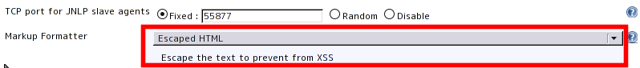
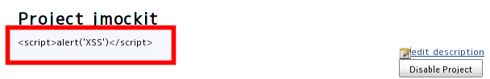

This plugin escapes the description of project, user, view, and build to
prevent from XSS.

**No longer needed as of 1.553.** The equivalent formatter is now in
Jenkins core.

## Configure Global Security page

\[x\] Enable Security

## Project page

## Version History

#### Version 0.1 (22 April, 2011)

-   First release
