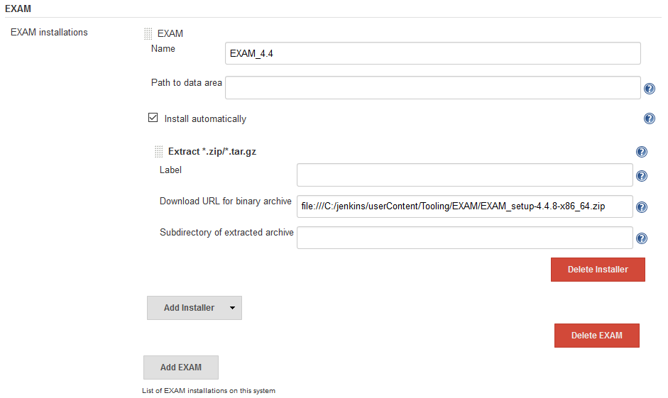
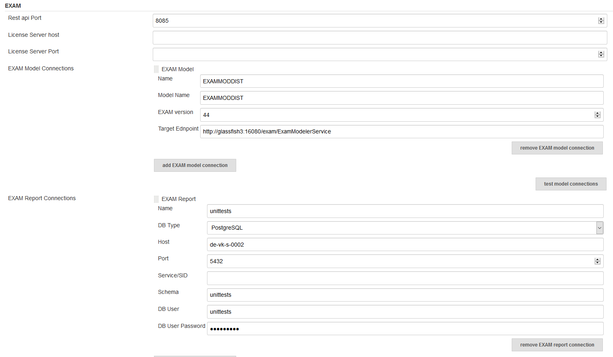
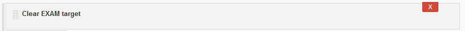
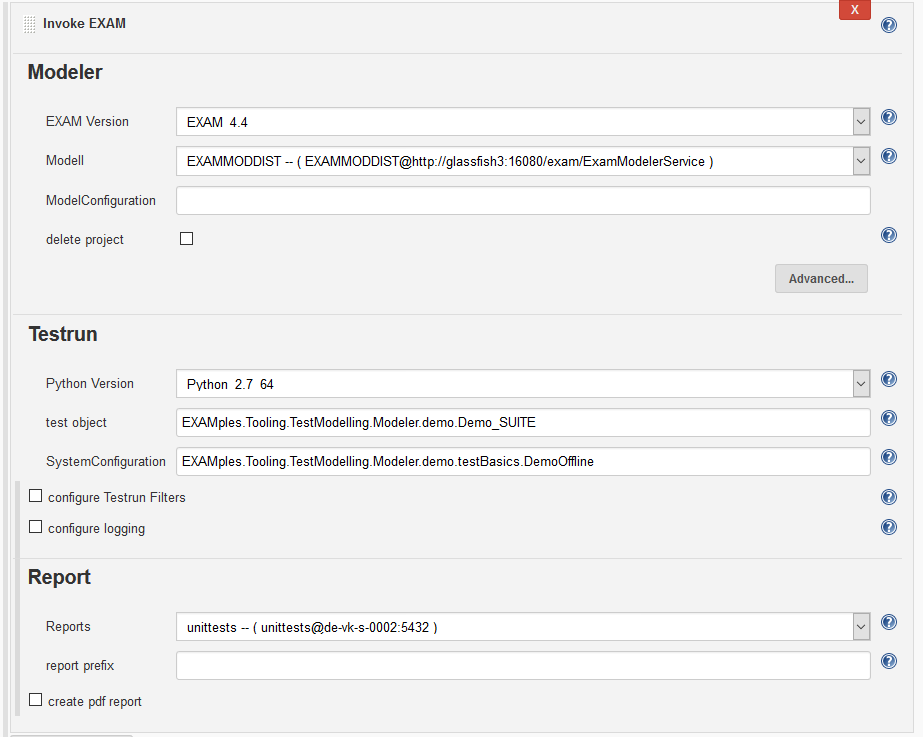
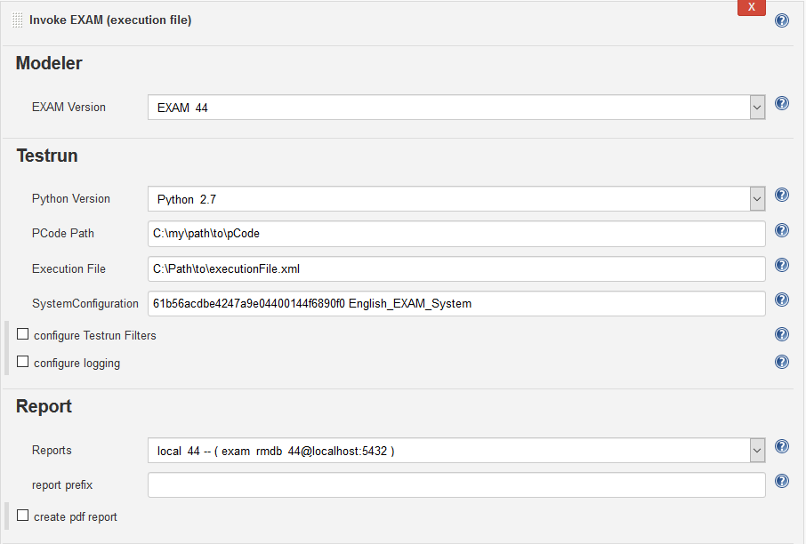

[{height="20"}](https://ci.jenkins.io/job/Plugins/job/exam-plugin/job/master/)

  
This plugin integrates the RESTapi of the Testautomation tool EXAM for
automated test execution. MicroNova EXAM Plugin is available for
download at [https://www.exam-ta.de](https://www.exam-ta.de/)  

  

EXAM is a graphical test development tool. EXAM defines a comprehensive
methodology based on UML to represent, implement and evaluate test
cases. It enables you to graphically model test processes in sequence
diagrams without programming knowledge. EXAM thus provides a uniform
language for the representation of test events. EXAM is suitable for use
in Hardware-in-the-Loop simulation (HiL), test bench automation and
industrial automation as well as in embedded development and
Software-in-the-Loop simulation (SiL).

# Table of contents

# Requirements

-   EXAM  
    -   EXAM 4.4/4.6/4.7
    -   RESTapi Plugin for EXAM

&nbsp;

-   Jenkins-Plugins
    -   shiningpanda
    -   workflow-step-api

# Configuration

## Global Tool Configuration

For this plugin to be used, an Ant installation must be specified in the
global Jenkins configuration

{height="400"}

  

## System Configuration

 general

Rest api Port

Port for the communication with the EXAM RESTapi

License Server Host

host name of the license server

License Server Port

port name of the license server

 EXAM Model Connection

Name

Identifier of this connection, which can be selected at the build step

Model Name

Name of the model known at the EXAM application server

EXAM version

The major and minor version number of EXAM

Target Endpoint

url of the EXAM application server

EXAM Report Connection

Name

Identifier of this connection, which can be selected at the build step

DB Type

Supported types are Oracle and PostgreSQL

Service/SID

Only needed, when Oracle is choosen as DB Type.

  

  

  

  

{width="900"}

## Job Configuration

The EXAM plugin provides 3 build steps.

1.  Clear EXAM target (use this to clear all junit formated reports
    bevor invoking an EXAM test)  
      
2.  Invoke EXAM model (invoke an EXAM test with a connection to a EXAM
    model)  

      

    Modeler

3.  Invoke EXAM execution file (invoke an EXAM test with an exported
    execution file)  

      

    Modeler

  

  

{width="700"}

  

  

  

{width="700"}

  

  

  

  

  

  

{width="700"}

  

#### Junit Report format

The EXAM reports are converted to standard junit format. To show the
result at Jenkins add a junit report step with the following expression:

    junit 'target/test-reports/**/*.xml'

# Changelog

Release 1.0.0

  
