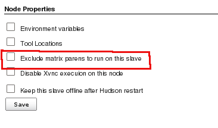

This plugin exclude flyweight task to be run on given slave.  
This plugin can also be used as a workaround for JENKINS-5076.

This plugin adds an "Exclude matrix parents to run on this slave" option
to a slave's configuration page. When this option is checked matrix
parents are not launched on this slave. This could be useful in a case
where you are using this slave for performance tests, and you want to be
sure that only the performance test is executed on this slave.

# Changelog

##### Release 1.1 (2011-06-08)

-   Fixed grammar

##### Release 1.0 (2011-02-10)

-   Initial release

 
