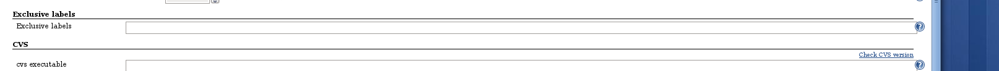

Plugin enables to define exclusive label

Exclusive label enables specify which lables ale exclusive in Jenkins
global configuration.

"Exclusive label" means that node with this label can be assigned only
if user wants this label. Example: a slave has three labels linux,
hibernate, ipv6 and ipv6 is exclusive label. The slave cannot be asigned
by label expression linux, hibernate, linux&&hibernate and so on because
this labels do not match ipv6. The slave can be assibned by expression
which match ipv6 too, for example: linux && ipv6.
