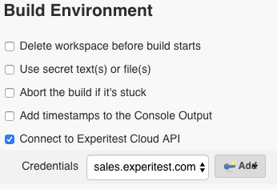
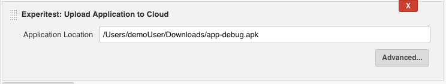

This plugin enables you to integrate your tests executed on Experitest
cloud using Jenkins.

You can 

1.  Upload your application to Experitest cloud using a simple build
    step
2.  Execute XCUItest and Espresso tests easily 

  

# Configurations:

After installing the plugin, check the option "Connect to Experitest
Cloud API" in your build environment:

  

 {height="236"}

  

Then, you can add the Experitest's cloud URL and Access Key on which you
would like to execute

{height="150"}

  

After you've configured the build environment, you'll be able to upload
applications to Experitest cloud and execute XCUItest and Espresso tests
through your CI pipeline.

  

### Uploading Application to Experitest cloud:

You can add a build step: Upload application to Cloud and specify the
path to your application

{height="140"}

Advanced options:

-   Provide UUID (Optional for iOS)
-   Include touchID libraries and allow mocking fingerprint
    authentication
-   Include Camera libraries and allow simulating camera options
-   Custom keystore (Optional for Android)

  

### Execute XCUITest and Espresso Tests:

You can add a build step: "Execute XCUITest or Espresso tests" and
provide some parameters in order to execute XCUITest or Espresso tests
on real devices/ virtual devices located in Experitest's cloud.

{height="250"}

  

Parameters:

-   Framework Type: select Espresso or XCUItest
-   Running type: Select Fast Feedback or Coverage.
    -   Fast Feedback - Get results for all the tests as soon as
        possible (will utilize all the devices that match the device
        query)
    -   Coverage - Will run **all ** the tests once on every device in
        the device query (you can write more than one query)
-   Application under test - Provide a path to the application location
-   Test Application - the test application (containing all the tests)
-   Device Query - List of strings (XPath queries). The tests will run
    on devices that match the provided query (1 device per query).
