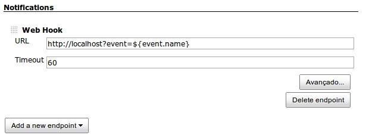
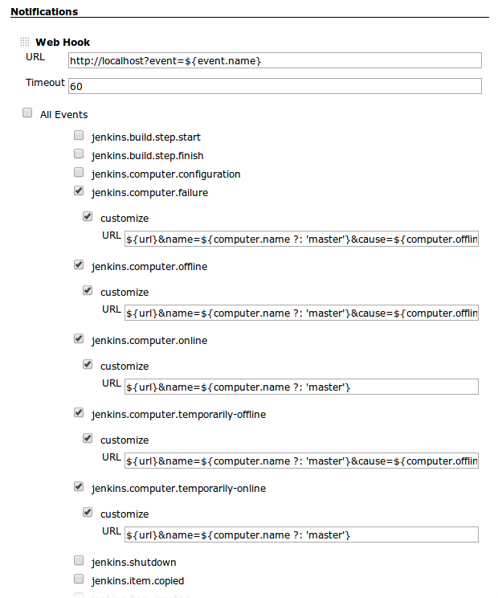

This plugin can notify some endpoints about events that occur in Jenkins

#### Endpoints

##### WebHook

Advanced event configuration:

##### Logging

TODO

#### Enpoints

###### jenkins.build.step.start

[AbstractBuild](http://javadoc.jenkins.io/hudson/model/AbstractBuild.html)
build,
[BuildStep](http://javadoc.jenkins.io/hudson/tasks/BuildStep.html) bs,
[BuildListener](http://javadoc.jenkins.io/hudson/model/BuildListener.html)
listener

###### jenkins.build.step.finish

[AbstractBuild](http://javadoc.jenkins.io/hudson/model/AbstractBuild.html)
build,
[BuildStep](http://javadoc.jenkins.io/hudson/tasks/BuildStep.html) bs,
[BuildListener](http://javadoc.jenkins.io/hudson/model/BuildListener.html)
listener, boolean canContinue

###### jenkins.computer.configuration

###### jenkins.computer.failure

[Computer](http://javadoc.jenkins.io/hudson/model/Computer.html)
computer,
[TaskListener](http://javadoc.jenkins.io/hudson/model/TaskListener.html)
listener

###### jenkins.computer.offline

[Computer](http://javadoc.jenkins.io/hudson/model/Computer.html)
computer

###### jenkins.computer.online

[Computer](http://javadoc.jenkins.io/hudson/model/Computer.html)
computer,
[TaskListener](http://javadoc.jenkins.io/hudson/model/TaskListener.html)
listener

###### jenkins.computer.temporarily-offline

[Computer](http://javadoc.jenkins.io/hudson/model/Computer.html)
computer,
[OfflineCause](http://javadoc.jenkins.io/hudson/slaves/OfflineCause.html)
cause

###### jenkins.computer.temporarily-online

[Computer](http://javadoc.jenkins.io/hudson/model/Computer.html)
computer

###### jenkins.item.copied

[Item](http://javadoc.jenkins.io/hudson/model/Item.html) item

###### jenkins.item.created

[Item](http://javadoc.jenkins.io/hudson/model/Item.html) item

###### jenkins.item.deleted

[Item](http://javadoc.jenkins.io/hudson/model/Item.html) item

###### jenkins.loaded

###### jenkins.item.renamed

[Item](http://javadoc.jenkins.io/hudson/model/Item.html) item, String
oldName, String newName

###### jenkins.item.updated

[Item](http://javadoc.jenkins.io/hudson/model/Item.html) item

###### jenkins.job.started

[Run](http://javadoc.jenkins.io/hudson/model/Run.html) run,
[TaskListener](http://javadoc.jenkins.io/hudson/model/TaskListener.html)
listener

###### jenkins.job.completed

[Run](http://javadoc.jenkins.io/hudson/model/Run.html) run,
[TaskListener](http://javadoc.jenkins.io/hudson/model/TaskListener.html)
listener

###### jenkins.job.finalized

[Run](http://javadoc.jenkins.io/hudson/model/Run.html) run

###### jenkins.job.deleted

[Run](http://javadoc.jenkins.io/hudson/model/Run.html) run

###### jenkins.matrix-config.started

[Run](http://javadoc.jenkins.io/hudson/model/Run.html) run,
[TaskListener](http://javadoc.jenkins.io/hudson/model/TaskListener.html)
listener

###### jenkins.matrix-config.completed

[Run](http://javadoc.jenkins.io/hudson/model/Run.html) run,
[TaskListener](http://javadoc.jenkins.io/hudson/model/TaskListener.html)
listener

###### jenkins.matrix-config.finalized

[Run](http://javadoc.jenkins.io/hudson/model/Run.html) run

###### jenkins.matrix-config.deleted

[Run](http://javadoc.jenkins.io/hudson/model/Run.html) run

###### jenkins.saveable.change

[Saveable](http://javadoc.jenkins.io/hudson/model/Saveable.html)
saveable, [XmlFile](http://javadoc.jenkins.io/hudson/XmlFile.html) file

###### jenkins.scm.changelog.parsed

[AbstractBuild](http://javadoc.jenkins.io/hudson/model/AbstractBuild.html)
build,
[BuildListener](http://javadoc.jenkins.io/hudson/model/BuildListener.html)
listener,
[ChangeLogSet](http://javadoc.jenkins.io/hudson/scm/ChangeLogSet.html)
changelog

###### jenkins.scm.poll.before

[AbstractProject](http://javadoc.jenkins.io/hudson/model/AbstractProject.html)
project,
[TaskListener](http://javadoc.jenkins.io/hudson/model/TaskListener.html)
listener

###### jenkins.scm.poll.success

[AbstractProject](http://javadoc.jenkins.io/hudson/model/AbstractProject.html)
project,
[TaskListener](http://javadoc.jenkins.io/hudson/model/TaskListener.html)
listener,
[PollingResult](http://javadoc.jenkins.io/hudson/model/PollingResult.html)
result

###### jenkins.scm.poll.failed

[AbstractProject](http://javadoc.jenkins.io/hudson/model/AbstractProject.html)
project,
[TaskListener](http://javadoc.jenkins.io/hudson/model/TaskListener.html)
listener, Throwable exception

###### jenkins.started

###### jenkins.plugins.listed

###### jenkins.plugins.prepared

###### jenkins.plugins.prepared

###### jenkins.plugins.started

###### jenkins.plugins.augmented

###### jenkins.jobs.loaded

###### jenkins.completed

###### jenkins.shutdown

NOOP
