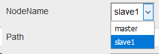
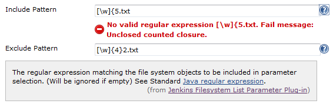
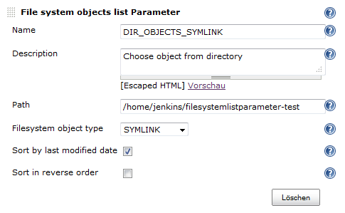

This plugin lists file, directory or symlink names of a directory
selectable for parameter.

### Change Log

##### Version 0.0.5 (March 23, 2019)

-   Add Slave support.  
    {height="88"}

##### Version 0.0.4 (February 23, 2018)

-   Compatibility changes [
    JENKINS-49649](https://issues.jenkins.io/browse/JENKINS-49649) -
    Getting issue details... STATUS

##### Version 0.0.3 (September 5, 2014)

-   Small bugfix
    [JENKINS-24586](https://issues.jenkins-ci.org/browse/JENKINS-24586)

##### Version 0.0.2 (June 1, 2014)

-   Add regular expression exclude and include filter for filesystem
    objects  
    
    -   **Include** and **exclude pattern** - regular expression to
        filter filesystem objects
        -   Regular expression will be checked with
            "java.util.regex.Pattern.compile(regex)"

##### Version 0.0.1 (March 31, 2014)

-   Initial release

The filesystem-list-parameter-plugin lists file system object names of a
directory. One of the object names can be selected as build parameter.
In addition the objects can be filtered: ALL, DIRECTORY, FILE, SYMLINK.
The order of the list can be reversed.

Here is a screenshot of the configuration page.

-   **Name** and **Description** should be clear
-   **Path** to the directory to select filesystem objects
-   **Filesystem object type** - filter for type of the file system
    objects that can be selected.
-   **Sort by last modified date** - If true, the list of the parameter
    values will be sorted by last modified file attribute. Default order
    is alphabetic sort by parameter value.
-   **Sort in reverse order** - If true, the list of the parameter
    values will be sorted in reverse order.
