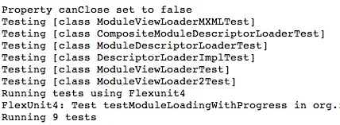
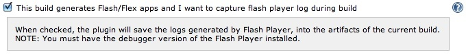
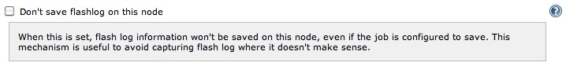

Captures Adobe Flash Player logs during a Hudson build in order to save
them as build artifacts. Useful to debug unit tests or integration
tests.

## Description

This plugin hooks up to the location where Flash Player is storing the
logs and records only what has been logged during a Jenkins build.

Clicking on flashlog.txt will give you the logs:

Note

Make sure you install the [debugger version of the Flash
Player](http://www.adobe.com/support/flashplayer/downloads.html),
otherwise Flash Player won't log anything.

## Plugin configuration options

##### At job level

##### At node level

In very rare cases in which the plugin might not identify the exact
location where Flash is recording the logs, you can define a custom path
to the flashlog.txt file.  

And you can also opt not to save the logs for some nodes, even if the
project is configured to save the logs.

