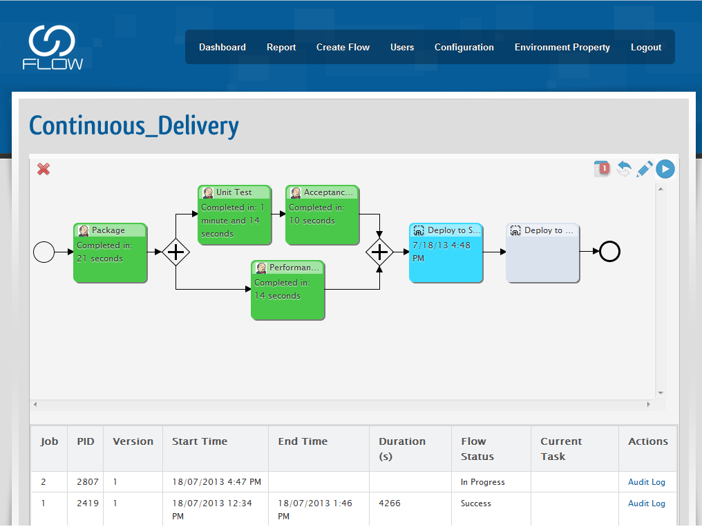
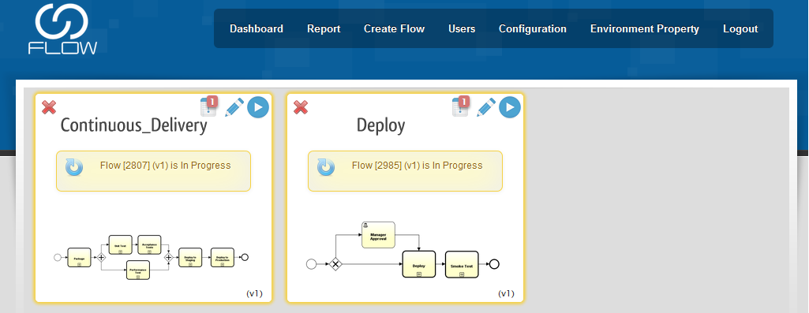
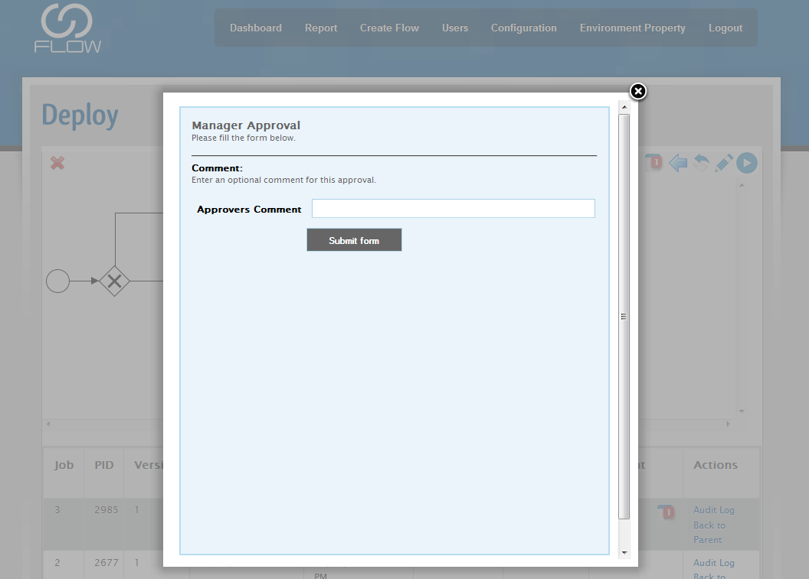
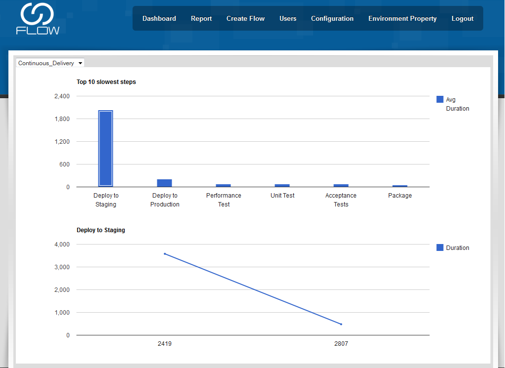

## [http://startflowing.net](http://startflowing.net/)

## Summary

Get true visibility of your processes - letting you see bottlenecks,
instability and what change to make next.
[http://startflowing.net](http://startflowing.net/).

Drag and drop your existing Jenkins jobs to form processes

## Release Notes

| Version | Date     | Notes                                                          |
|---------|----------|----------------------------------------------------------------|
| 1.3     | Oct-2013 | <http://startflowing.net/index.php/blog/entry/flow-release-03> |

## Screenshots

{width="889"
height="671"}  
{width="890"
height="349"}  
{width="889"
height="424"}  
{width="889"
height="637"}  
{width="889"
height="649"}
