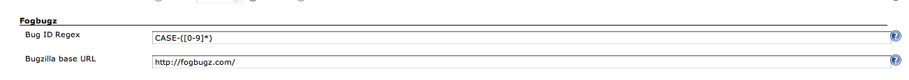
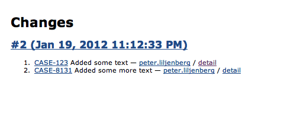

This plugin integrates [FogBugz](http://www.fogcreek.com/fogbugz/) with
Jenkins.

The plugin annotates case numbers appearing in changeset descriptions
with links to the Findbugs case detail page.

Future plans include using the XML API for Fogbugz to add tooltips for
the linked case showing some info.

### Configuration

The plugin is configured on the Global Configuration page. Jenkins needs
to know the url to your Fogbugz server, as well as the regular
expression to be used to match Case Ids in the change set data.

Once the configuration is done (and correct) the plugin will generate
hyperlinks for the texts in the changesets matched by the regular
expression.

Advanced usage together with the [Gatekeeper
plugin](https://wiki.jenkins-ci.org/display/JENKINS/Gatekeeper+plugin):  
.png)  
.png)  
.png)

Please also check [this
article](http://developer.paylogic.com/articles/codereview.html).

### Changelog

##### Version 2.2.7 (2014-09-25):

Clearer url trigger response in case of nothing scheduled (bubenkoff)

##### Version 2.2.6 (2014-09-23):

Notify the case when the job is triggered but the url
trigger (bubenkoff)

##### Version 2.2.5 (2014-09-20):

Remove falsy Fogbugz notifications about the scheduled
builds (bubenkoff)

##### Version 2.2.4 (2014-09-18):

Schedule builds for all awaitng Fogbugz cases instead of single
one (bubenkoff)

##### Version 2.2.3 (2014-08-25):

Latest jenkins (1.577) support (bubenkoff)

##### Version 2.2.0 (2014-07-18):

Improved the fogbugz case reporting, bugfixes (bubenkoff)

##### Version 2.0.2 (2014-04-14):

Lowered the required Jenkins version to the latest LTS version (1.532).

##### Version 2.0 (2014-01-16):

Maikel Wever and Anatoly Bubenkov developed a separate plugin so they
contributed their code to this one instead.

Support for:

reporting build status to a case if the build has CASE\_ID as build
parameter  
creating a new case on every new test failure (seperate build action)  
basic access to the fogbugz api using a seperate package (which we also
made), the plugin handles the authentication part so it's available to
more Jenkins plugins. (can speed up \#2 )  
creating Actions on a build page if the build is linked with a
CASE\_ID  
support for triggering one build by pointing a Fogbugz URLtrigger to a
Jenkins endpoint

-   reporting build status to a case if the build has CASE\_ID as build
    parameter
-   creating a new case on every new test failure (separate build
    action)
-   basic access to the fogbugz api using a separate package, the plugin
    handles the authentication part so it's available to more Jenkins
    plugins.
-   creating Actions on a build page if the build is linked with a
    CASE\_ID
-   support for triggering one build by pointing a Fogbugz URLtrigger to
    a Jenkins endpoint

**Version 1.0 (2012-01-19):**

Initial release
