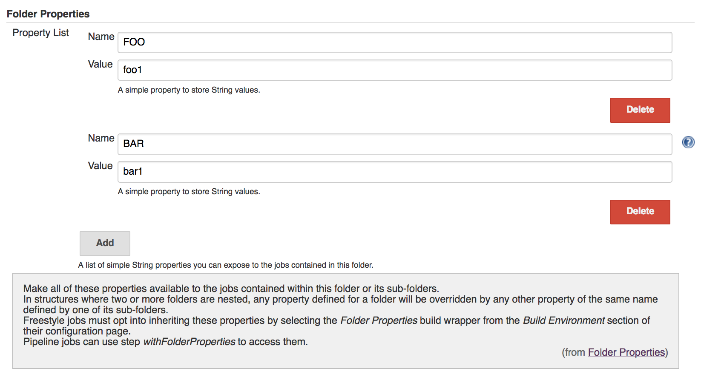
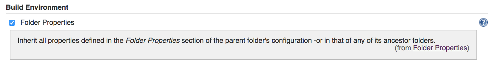

A Jenkins plugin which allows users with config permission to define
properties for a folder which can then be used by any jobs contained
within it or any of its sub-folders. 

You can find [this plugin's source code on
Github](https://github.com/jenkinsci/folder-properties-plugin).

 

# About this Plugin

The aim here is to remove the need to specify the same properties over
and over again for all the jobs inside a folder.

In structures where two or more folders are nested, any property defined
for a folder will be overridden by any other property of the same name
defined by one of its sub-folders.

## Configuring Folder Properties

Just create a
[folder](http://localhost:8085/display/JENKINS/CloudBees+Folders+Plugin),
go to its configuration page and add as many properties as you need
under the `Folder Properties` section.

{height="250"}

## Freestyle Jobs

Freestyle jobs must opt into the `Folder Properties` build wrapper from
the `Build Environment` section of their configuration page in order to
be able to access these properties as they would any other environment
variable.



## Pipeline Jobs

Pipeline jobs can use step `withFolderProperties` to access them:

**Using folder properties in a pipeline job**

``` syntaxhighlighter-pre
withFolderProperties{
    echo("Foo: ${env.FOO}")
}
```

Jenkins deployments using some of the older versions of the [Structs
Plugin](http://localhost:8085/display/JENKINS/Structs+plugin) will need
to do this using the `wrap` meta-step:

**Using folder properties in older pipeline jobs**

``` syntaxhighlighter-pre
wrap([$class: 'ParentFolderBuildWrapper']) {
    echo("Foo: ${env.FOO}")
}
```

## Job DSL

In Job DSL scripts you can define folder properties like so:

**Job DSL example**

``` syntaxhighlighter-pre
folder('my folder') {
    properties {
        folderProperties {
            properties {
                stringProperty {
                    key('FOO')
                    value('foo1')
                }
            }
        }
    }
}
```
